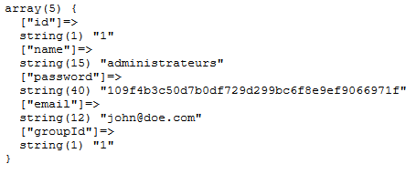
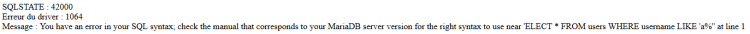
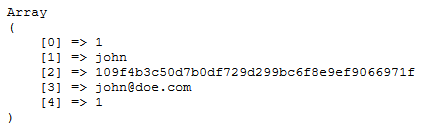
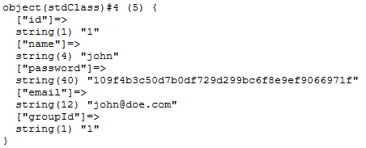
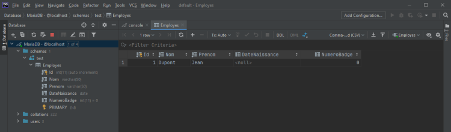
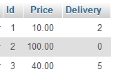
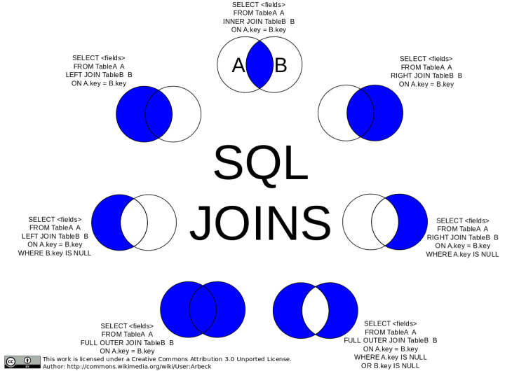
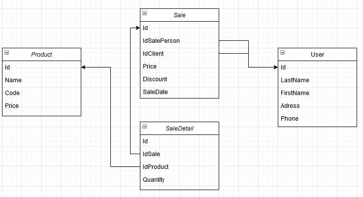
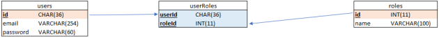

# Qu'est-ce que PDO ?

PDO est une interface orientée objet qui permet de communiquer avec une base de données de manière uniforme, quel que soit son moteur. Ainsi, les méthodes à appeler seront toujours les mêmes, ce qui facilite grandement le travail : seule la syntaxe des requêtes pourra changer d'un moteur à l'autre.

En interne, PDO fonctionne grâce à un système de drivers. Il existe un driver par moteur de base de données et, au moment de la connexion, PDO s'occupe de charger le driver correspondant. Cette opération est transparente pour le développeur, qui ne manipulera qu'un objet de type PDO dans tous les cas.


# DataSourceName

Le DataSourceName (ou DSN) est une sorte d'adresse de notre base de données : c'est une chaîne de caractères contenant toutes les informations nécessaires pour se connecter, comme le login, le mot de passe, l'adresse IP du serveur, etc.

Un DSN est composé d'un préfixe et de plusieurs attributs possédant chacun une valeur, et qui sont séparés par des points-virgules. Le format final d'un DSN est donc : prefixe:clef1=valeur1;clef2=valeur2.

## Le préfixe

Le préfixe désigne le moteur de base de données qui sera utilisé, et donc le driver que l'objet PDO devra charger.

Chaque moteur est identifié par une chaîne de caractères qui lui est propre. Par exemple, pour utiliser PDO avec une base de données MySQL, le DSN devra être préfixé par mysql. En revanche, pour utiliser une base de données PostgreSQL, il faudra utiliser le préfixe pgsql. Tous les préfixes devront ensuite être suivis par deux points pour les séparer des attributs.

En cas de doute, la liste complète des drivers supportés par PDO, et leurs préfixes associés, est disponible dans la documentation PHP des drivers PDO.

## Les attributs

Les attributs représentent les informations de connexion et leur valeur. Ils sont représentés par un ensemble de mots-clefs associés à une valeur via le symbole égal (=) et séparés par des points-virgules.

Ces attributs sont le plus souvent l'hôte, qui aura pour valeur l'adresse IP du serveur hébergeant notre base de données, le nom de la base de données avec laquelle nous souhaitons interagir, le nom de l'utilisateur et le mot de passe de connexion.

Cette liste d'attributs de base est une liste indicative : les attributs à fournir pour pouvoir se connecter, ainsi que leurs noms, peuvent changer d'un moteur à un autre. Il est donc important de vérifier dans la documentation quels sont les attributs nécessaires à la connexion.

## Exemples de DSN

Pour se connecter à une base de données PostgreSQL, la documentation indique que le préfixe est pgsql et qu'il y a besoin des attributs host, port, dbname, user et password. Le DSN aura donc la forme : pgsql:host=localhost;port:5432;dbname=nomBDD;user=utilisateur;password=motDePasse.

On remarque l'utilisation de localhost à la place de l'adresse IP : cela signifie simplement que notre base de données est hébergée sur le même serveur que notre application.

Dans le cas d'une base de données DB2 IBM, la documentation indique un préfixe ibm et les attributs database, hostname, port, username et password, mais aussi la présence des champs protocol et driver, qui ont des valeurs fixes. Le DSN aura donc la forme :

ibm:DRIVER={IBM DB2 ODBC DRIVER};DATABASE=testdb;HOSTNAME=localhost;PORT=50000;PROTOCOL=TCPIP;UID=utilisateur;PWD=motDePasse.

Il existe des cas, comme pour les bases de données MySQL, où le nom d'utilisateur et le mot de passe ne font pas partie du DSN, mais doivent être spécifiés ailleurs. Il faut donc toujours vérifier dans la documentation pour savoir comment former un DSN pour un moteur donné.

# Créer un objet PDO

Pour se connecter à notre base, il faut créer une instance de la classe PDO en lui fournissant le DSN dans le constructeur. Par exemple, pour se connecter à une base de données PostgreSQL, il faut créer un objet PDO avec un DSN sous la forme :

```php
<?php

$pdo = new PDO('pgsql:host=localhost;port=5432;dbname=nomBDD;user=utilisateur;password=motDePasse';
```

Le constructeur accepte également 3 autres arguments facultatifs : les identifiants (login et mot de passe), qui ne doivent être renseignés que s'ils ne sont pas présents dans le DSN, et un tableau d'options, qui dépendent du moteur de base de données. Par exemple, pour se connecter à une base de données MySQL dont les identifiants de connexion ne sont pas dans le DSN, il faudra rajouter ces informations dans le constructeur :

```php
<?php

$pdo = new PDO('mysql:dbname=nomBDD;host=localhost', 'utilisateur', 'motDePasse');
```

## Gérer les erreurs

En cas de problème lors de la connexion, le constructeur va lancer une exception de type PDOException. Pour gérer ce cas d'erreur, il faut donc enfermer la création de chaque nouvelle instance dans un bloc try et catch l'exception.

```php
<?php

try {
    $pdo = new PDO('mysql:dbname=nomBDD;host=localhost', 'utilisateur', 'motDePasse');
} catch (PDOException $e) {
    // Gestion de l'exception
}
```

## Risque de sécurité

Si cette exception n'est pas attrapée, elle risque d'afficher un message d'erreur comportant les données de connexion à la base de données (comme le DSN ou le login/mot de passe fourni). Ces informations très sensibles et leur affichage représentent une très importante faille de sécurité. Il est donc recommandé de toujours catch les PDOException et de ne jamais les throw directement. Il est également recommandé de masquer l'affichage des messages d'erreur sur les serveurs de production pour éviter tout risque.

## Déconnexion et connexions persistantes

Une fois l'objet créé et la connexion effectuée, elle sera automatiquement fermée lorsque le destructeur de l'objet sera appelé : soit si l'objet est détruit manuellement, soit automatiquement à la fin du script.

```php
<?php

$pdo = new PDO('mysql:dbname=nomBDD;host=localhost', 'utilisateur', 'motDePasse');
$pdo = null; //Déconnexion

$pdo2 = new PDO('mysql:dbname=nomBDD;host=localhost', 'utilisateur', 'motDePasse');
// Fin du script : déconnexion automatique
```

Pour garder la connexion ouverte entre les différents scripts, il est possible de créer une connexion persistante. Ainsi, plutôt que de se fermer automatiquement, la connexion restera ouverte et, au prochain appel d'une connexion avec le même DSN, c'est la connexion précédemment ouverte qui sera utilisée au lieu d'en créer une nouvelle.

Cela se fait en utilisant l'option PDO::ATTR_PERSISTENT au moment de l'ouverture de la connexion.

```php
<?php

// Le tableau d'options est le 4ème paramètre du constructeur
$pdo = new PDO('mysql:dbname=nomBDD;host=localhost', 'utilisateur', 'motDePasse', [PDO::ATTR_PERSISTENT => true]);
```

Tous les moteurs de base de données ne sont pas compatibles avec cette option. De plus, d'autres moteurs peuvent n'autoriser qu'un certain nombre de connexions en parallèle, limite qui serait atteinte rapidement en utilisant des connexions persistantes, ce qui provoquerait des erreurs de connexion. Cette solution ne doit être envisagée que dans certains cas où la connexion à la base de données est très lente, et son utilisation doit être surveillée attentivement.

## Lancer une requête

Il existe plusieurs méthodes permettant d'exécuter des requêtes via PDO. Celle que nous allons utiliser pour le CREATE DATABASE est également la plus simple : la méthode exec().

Cette méthode permet de lancer une requête et retourne le nombre de lignes qui ont été affectées. Elle peut également retourner false si la requête a échoué. Ainsi, si on envoie une requête UPDATE, cette méthode retournera le nombre de lignes qui ont été modifiées.

Dans le cas d'une création de base de données, ce nombre n'a pas d'importance : nous devons simplement nous assurer qu'un booléen n'est pas reçu.

```php
<?php
try {
    // Exemple avec une base de données MySQL avec les identifiants par défaut
    $pdo = new PDO('mysql:host=localhost', 'root', '');
    if ($pdo->exec('CREATE DATABASE testBdd') !== false) {
        echo 'Base de données créée';
    } else {
        echo 'Une erreur est survenue';
    }
} catch (PDOException $e) {
    //Gestion de l'erreur de connexion
}
```

# Notre premier but va être d'afficher la liste de tous les utilisateurs dans notre application PHP.


Lancer une requête SELECT

La manière la plus simple de récupérer des données depuis une base de données grâce à PDO est d'utiliser la méthode query. Elle prend en paramètres une requête SQL et un mode de récupération et retourne le résultat de la requête sous un format qui dépend du mode choisi.

Pour le moment, nous allons utiliser le mode PDO::FETCH_ASSOC, qui signifie que chaque ligne de données sera sous forme de tableau associatif dont les clés ont le même nom que les colonnes récupérées dans le SELECT.


Il suffit ensuite de boucler sur les résultats pour manipuler chaque ligne. Pour cela, il est possible d'utiliser la méthode query directement dans un foreach :

```php
<?php
// Initialisation de l'objet PDO, construction de la requête...
foreach ($pdo->query($sqlRequest, PDO::FETCH_ASSOC) as $row) {
    // Ici, la variable $row est un tableau associatif
}
```
Pour afficher la liste de tous nos utilisateurs, il suffit d'envoyer une requête de sélection sur la table User et de boucler sur le résultat. Par exemple, le code suivant permet d'afficher les noms et e-mails de chaque utilisateur :

```php
<?php
try {
    $pdo = new PDO('mysql:host=localhost;dbname=php_app', 'root', '');
    foreach ($pdo->query('SELECT name, email FROM users', PDO::FETCH_ASSOC) as $user) {
        echo $user['name'].' '.$user['email'].'<br>';
    }
} catch (PDOException $e) {
    echo 'Impossible de récupérer la liste des utilisateurs';
}
```

Il est possible d'utiliser la méthode query() pour des requêtes qui ne sont pas des requêtes de sélection, mais dans ce cas, le résultat sera vide. Pour les autres requêtes, il est recommandé d'utiliser exec(), qui retourne le nombre de lignes affectées.

## Jointures et alias

Chaque clé du tableau associatif est basée sur le champ présent dans le SELECT et non pas sur le nom de la colonne de la table. Même si, dans de nombreux cas, ces deux valeurs sont similaires, cela signifie qu'il est possible de changer les colonnes du tableau grâce à l'utilisation d'alias dans le SELECT.

```php
<?php
try {
    $pdo = new PDO('mysql:host=localhost;dbname=php_app', 'root', '');
    // On utilise un alias, grâce au mot-clé AS
    foreach ($pdo->query('SELECT name AS nom, email AS adresse FROM users', PDO::FETCH_ASSOC) as $user) {
        // Ici, on utilise le nom de l'alias et non celui de la colonne
        echo $user['nom'].' '.$user['adresse'].'<br>';
    }
} catch (PDOException $e) {
    echo 'Impossible de récupérer la liste des utilisateurs';
}
```

Or, dans un tableau associatif, il ne peut pas y avoir deux clés ayant le même nom. Cela signifie que, si dans la requête SELECT deux colonnes portent le même nom, alors l'une d'entre elles sera écrasée. Par exemple, admettons que nos utilisateurs puissent appartenir à un groupe et que chaque groupe possède son propre nom :


La jointure entre ces deux tables, issue de la requête SELECT * FROM users JOIN groups ON groups.id = users.groupId, devrait comporter 7 colonnes. Or, le tableau associatif généré par PDO n'en contiendra que 5 : les clés id et name sont écrasées.



Pour éviter cette perte de données, il est possible de renommer les champs en double en utilisant des alias. Ainsi, on peut renommer les champs ayant un nom identique grâce à la requête :

```sql
SELECT 
    users.id AS userId, 
    users.name as userName, 
    users.password, 
    users.email, users.groupId, 
    groups.* 
FROM users 
JOIN groups ON groups.id = users.groupId
```

# Les limites de query

Améliorons un peu notre liste d'utilisateurs en ajoutant un champ de recherche sur notre application : un utilisateur pourra ainsi en rechercher un autre par son nom. Nous allons donc devoir améliorer notre requête SELECT pour lui ajouter une clause WHERE permettant de filtrer les résultats.

Pour cela, nous allons utiliser l'opérateur LIKE et injecter la valeur saisie par l'utilisateur, suivie d'un symbole %. Ainsi, en recherchant simplement « a », le résultat sera la liste de tous les utilisateurs dont le nom commence par la lettre « a ».

En utilisant la méthode query, cela donne le code suivant :

```php
<?php
$pdo->query('SELECT * FROM users WHERE name LIKE \''.$_GET['search'].'%\'', PDO::FETCH_ASSOC);
```

Cette requête fonctionne pour les recherches simples, mais si l'utilisateur recherche un terme comportant un apostrophe, elle ne sera plus valide et soulèvera une erreur. Pire, un utilisateur malintentionné pourrait utiliser cette faiblesse pour faire de l'injection SQL et manipuler notre base de données.

Nous allons donc devoir gérer nous-mêmes l'échappement des caractères. Le problème est que sa syntaxe dépend du SGBD : certains permettent de doubler l'apostrophe, mais d'autres acceptent également l'antislash, ce qui en fait un processus plus complexe à mettre en place, qu'il faudra répéter pour chaque requête.

Heureusement, PDO peut gérer ça, pour nous, grâce aux requêtes préparées.

$_GET est un tableau de données associatif et super globale qui va permettre de faire passer des informations de page en page grâce à l’url.

## Les injections SQL

Une injection SQL (« Structured Query Language », langage de requête structurée ) représente un type de cyberattaque. Le pirate effectuant cette attaque va modifier une requête SQL en cours en injectant un “morceau” de requête, pour manipuler une base de données et accéder à des informations importantes.

Il s’agit d’un des genres d’attaques les plus populaires et menaçants, car il peut être utilisé pour nuire à n'importe quelle application ou site Web qui dispose d’une base de données SQL.L'injection SQL est uniquement réalisable lorsqu’une requête est générée à partir de données fournies par un utilisateur.

Ces données sont directement exploitées pour construire toute une requête ou seulement une partie. Il peut s’agir d’un insert, un update, une jointure, de conditions de filtrages ou de regroupement.

Grâce à une utilisation adaptée de l'objet PDO pour préparer les requêtes MySQL en PHP, il est impossible pour une personne mal intentionnée de réaliser des injections SQL.

Ci-dessous se trouve une requête nous permettant de sélectionner et d’afficher toutes les données de la table user où le champs username prendra comme valeur le contenu de la variable $username et pass, celui de $password.

```php
$sql = “SELECT * FROM `users` WHERE `username`=’$username’ AND `pass`=$password”;
$requete = $db->query($sql);
$user = $requete->fetchAll();

	var_dump($user);
```

En remplissant la variable $username de la manière suivante, nous exploitons une faille.

```php
$username = “admin’;  --”;
$password = “”;
```

En effet, en procédant de cette façon, ‘--’ permettant de créer un commentaire en langage SQL, tout ce qui se trouve à la suite de celui-ci devient commenter. Nous avons donc accès aux informations concernant l’admin, dont son mot de passe.

```php
 $sql = “SELECT * FROM `users` WHERE `username`=’admin’; --’ AND `pass`=$password”;
```

## Requêtes préparées

Une requête préparée est une requête possédant des paramètres, dans laquelle nous allons injecter des valeurs. Ainsi, plutôt que de former la requête nous-mêmes en utilisant la concaténation de chaînes de caractères, nous allons placer des marqueurs que PDO remplacera par les valeurs au moment de son exécution.

Pour utiliser une requête préparée, il y a deux étapes à respecter : la première est de préparer la requête, c'est-à-dire déclarer une requête possédant des marqueurs ; il faut ensuite exécuter cette requête, en renseignant la valeur des marqueurs.

On peut voir une requête préparée un peu comme une « requête-fonction » : on doit d'abord la déclarer en indiquant les paramètres attendus en entrée, puis l'appeler en renseignant ses paramètres.

L'avantage d'utiliser des requêtes préparées est qu'au moment où PDO va injecter les valeurs dans nos marqueurs, il va échapper automatiquement tous les caractères qui ont besoin de l'être, en utilisant la méthode d'échappement correspondant au driver utilisé.

## Les marqueurs

Il existe deux types de marqueurs que l'on peut utiliser dans une préparation de requête : les marqueurs nommés et les marqueurs interrogatifs.

- Les marqueurs nommés permettent, d'attribuer un nom à chaque paramètre. Ils se déclarent dans la requête grâce à la syntaxe :nomMarqueur. SELECT * FROM users WHERE name LIKE :search

- Les marqueurs interrogatifs, quant à eux, vont se baser sur la position du paramètre plutôt qu'un nom. Ils se déclarent dans la requête grâce à un point d'interrogation. SELECT * FROM users WHERE name LIKE ?

!
Chaque marqueur représente une valeur à part entière. Dans notre condition, nous souhaitons rajouter un % à la fin de notre paramètre, mais ce caractère fera partie de la valeur de notre marqueur. Ainsi, il n'est pas possible d'écrire : SELECT * FROM users WHERE name LIKE :search%.

C'est la valeur du paramètre :search qui contiendra le symbole %.

Il n'est pas non plus possible d'utiliser les marqueurs pour remplacer des noms de colonne ou des opérateurs : seulement des valeurs.
!

## Préparer une requête

Pour préparer une requête, il faut utiliser la méthode prepare de notre objet PDO. Elle prend en paramètre la requête préparée et retourne un objet de type PDOStatement.

Cette méthode n'exécute pas la requête : elle ne fait que la garder en mémoire pour pouvoir la manipuler via le PDOStatement.

## PDOStatement

Un objet PDOStatement est la représentation d'une requête et permet de réaliser toutes les actions que l'on fait habituellement avec une requête : l'exécuter, récupérer le résultat, renseigner les valeurs des marqueurs, récupérer les erreurs, etc.

On peut voir la classe PDO comme une Factory qui va permettre d'instancier des PDOStatement, un par requête que l'on va vouloir exécuter.

Factory est un design pattern permettant de mieux structurer des classes. Le but étant d’obtenir une classe qui va se charger de créer plusieurs objets en utilisant une rédaction plus simple à base de méthodes statiques qui retourneront des instances.

## Renseigner les valeurs des marqueurs

L'objet PDOStatement va nous permettre de renseigner les valeurs de nos marqueurs. Pour cela, il met deux méthodes à notre disposition : bindValue et bindParam.

- Ces deux méthodes, très similaires, prennent deux paramètres obligatoires : le marqueur à remplacer et la valeur à lui attribuer. Le premier paramètre va différer selon le type de marqueur utilisé : pour les marqueurs nommés, il faut passer le nom du marqueur, tandis que pour des marqueurs interrogatifs, il faut passer leur position.

- La différence entre les deux méthodes est subtile, mais à son importance : bindValue va permettre de lier une valeur à un paramètre, tandis que bindParam va lier une variable par référence à un paramètre. Ainsi, avec bindParam, si le paramètre est modifié dans la requête SQL (par exemple, lors d'appels à des procédures stockées), alors la variable PHP sera également modifiée.

- Le troisième paramètre, facultatif mais recommandé, est le type de variable à choisir entre PDO::PARAM_NULL, PDO::PARAM_BOOL, PDO::PARAM_INT et PDO::PARAM_STR. Cela permet d'indiquer à PDO comment formater les valeurs (par exemple, les mettre entre apostrophes dans le cas d'une chaîne de caractères). Par défaut, PDO les considère comme des chaînes de caractères.

Dans les deux cas suivants, nous retrouvons des marqueurs nommés. L’un est utilisé par bindValue, l’autre par bindParam. En effet, dans le premier exemple ci-dessous, lors de l'exécution de la requête, la valeur de $username prise en compte sera ‘Jean’ car elle est rattachée au marqueur de la requête. 

```php
	<?php
  $username = 'Jean';
  $password = '1234';
  // Marqueurs nommés et bindValue:
		$statement = $pdo->prepare(“SELECT * FROM users WHERE `username`=:username AND 
  ` pass`=:pass”);
  $statement->bindValue(':username', $username, PDO::PARAM_STR);
  $statement->bindValue(':pass', $password, PDO::PARAM_STR);
  $username = 'Pierre';
  $statement->execute();
  $user = $requete->fetchAll();
```

Dans le cas contraire qui est le suivant, $username prendra comme valeur ‘Pierre’ lors de l’exécution de la requête car tant que celle-ci n’a pas aboutie, la valeur injectée pourra être modifiée.

```php
	<?php
	$username = 'Jean';
	$password = '1234';
	// Marqueurs nommés et bindParam:
	$statement = $pdo->prepare(“SELECT * FROM users WHERE `username`=:username AND `pass`=:pass”);
	$statement->bindParam(':username', $username, PDO::PARAM_STR);
	$statement->bindParam(':pass', $password, PDO::PARAM_STR);
	$username = 'Pierre';
	$statement->execute();
	$user = $requete->fetchAll();
```

Il s’agit du même fonctionnement avec les marqueurs interrogatifs et les seules données changeante seront :

```php
    // Marqueurs interrogatifs et bindParam:
    $statement = $pdo->prepare(“SELECT * FROM users WHERE `username`=? AND `pass`=?”);
    $statement->bindParam(1, $username, PDO::PARAM_STR);
    $statement->bindParam(2, $password, PDO::PARAM_STR);
```

Il est à noter que bindParam doit obligatoirement avoir une variable en paramètre, puisqu'elle la lie par référence.

!
Contrairement à ce à quoi on commence à être habitué en informatique, la position des marqueurs interrogatifs commence à 1 et non à 0.
!

Les cas d'utilisation de bindParam sont très spécifiques. Dans la majorité des cas, bindValue est amplement suffisant et est plus pratique à manipuler.

## Exécuter la requête

Une fois les paramètres renseignés, nous allons pouvoir exécuter notre requête préparée. Pour cela, il suffit d'utiliser la méthode execute de notre objet PDOStatement. Cette méthode retourne un booléen indiquant si la requête s'est bien déroulée ou non.

En cas d'erreur, la méthode errorInfo permet de récupérer des informations sur l'erreur. Elle retourne un tableau, dont le premier élément est le SQLSTATE (c'est-à-dire le code d'erreur SQL), le second élément est le code d'erreur du driver et le troisième est le message d'erreur.

```php
<?php
$pdo = new PDO('mysql:host=localhost;dbname=intro_pdo', 'root', '');
// Faute de frappe volontaire dans la requête pour tester l'erreur
$statement = $pdo->prepare('ELECT * FROM users WHERE name LIKE :name');
$statement->bindValue(':name', 'a%', PDO::PARAM_STR);
if ($statement->execute()) {
    // La requête s'est bien déroulée
} else {
    $errorInfo = $statement->errorInfo();
    echo 'SQLSTATE : '.$errorInfo[0].'<br>';
    echo 'Erreur du driver : '.$errorInfo[1].'<br>';
    echo 'Message : '.$errorInfo[2];
}
```



!
À l'image des PDOException, les informations remontées par errorInfo sont susceptibles de comporter des informations sensibles concernant votre base de données. Il est fortement recommandé de logger ces erreurs plutôt que de les afficher directement sur la page.
!

```php
<?php 
  // Message d'erreur à sauvegarder
  $errorMessage = "Ceci est un message d'erreur!"; 
    
  // Chemin du fichier log où les erreurs doivent être sauvegardées
  $logFile = "./errors.log"; 
    
  // Enregistrement du message d'erreur dans le fichier log
  error_log($errorMessage, 3, $logFile); 
?>
```

Il est également possible de passer un tableau contenant les valeurs de nos marqueurs en paramètre d'execute : PDO fera automatiquement des bindValue en utilisant les valeurs fournies. Dans le cas de marqueurs nommés, chaque clé doit correspondre à un nom de paramètre. En revanche, pour les marqueurs interrogatifs, seul l'ordre des valeurs dans le tableau compte.

```php
<?php
// Marqueurs nommés
$statement = $pdo->prepare('SELECT * FROM users WHERE name LIKE :name');
if ($statement->execute([':name' => 'j%'])) {
    // La requête s'est bien déroulée
}

// Marqueurs interrogatifs
$statement = $pdo->prepare('SELECT * FROM users WHERE name LIKE ?');
if ($statement->execute(['j%'])) {
    // La requête s'est bien déroulée
}
```

## Exécuter plusieurs requêtes

En plus des avantages de sécurité des requêtes préparées, celles-ci sont aussi très performantes pour exécuter des requêtes similaires. En effet, lorsqu'un SGBD reçoit une requête, il va d'abord l'analyser pour optimiser la requête avant de l'exécuter.

Cette phase d'optimisation ne dépend pas des valeurs de nos filtres : elle se base uniquement sur les tables et les champs qui sont impliqués dans la requête. Ainsi, utiliser la méthode query pour lancer plusieurs fois la même requête, mais avec des valeurs différentes, va lancer cette phase d'optimisation pour chaque requête, ce qui n'est pas optimal.

En revanche, préparer une requête permet au SGBD de ne l'analyser qu'une seule fois : chaque nouvelle exécution utilisera la même optimisation.

## Créer des procédures stockés

Les procédures stockées sont utilisables depuis la version 5 de mySQL. À la différence des requêtes préparées, ces procédures sont stockées durablement et font partie de la base de données dans laquelle elles sont enregistrées.

Elles sont utilisées en administration de base de données afin d’exécuter une série d’instructions SQL désignées par un nom.

Une fois celles-ci créées il est possible de les appeler par leurs noms. Nous allons maintenant apprendre et comprendre comment créer une procédure stockée. Tout d’abord, pour créer une procédure, la commande à exécuter est CREATE PROCEDURE suivi du nom que l’on souhaite lui donner. Suite à cela, on ajoutera des parenthèses OBLIGATOIRES qui nous permettront de définir les futurs paramètres de la procédure.


```sql
CREATE PROCEDURE nom_de_la_procedure()   
```

Venons en au corps de la procédure : c'est dans ce corps que l'on rentre le contenu de la procédure, il s’agit de ce qui sera exécuté. Il peut être question d’une requête ou d’un bloc d’instruction.

```sql
CREATE PROCEDURE nom_de_la_procedure()    
corps de la procédure;
```

Afin de délimiter un bloc d'instructions, on utilise les termes BEGIN et END.

```sql
CREATE PROCEDURE nom_de_la_procedure()  
BEGIN  
		--instructions;
END;
```

En revanche, ce simple aperçu de code précédent risque de nous poser problème car dans le cas où nous remplacerions votre commentaire par une série d’instructions, il y aurait un conflit. En effet, le premier “;” pourrait porter atteinte au bon déroulement de l’exécution du code car il provoque la fin de l’exécution avant “END;”.

Afin de remédier à ce problème, il existe ce que l'on appelle un délimiteur. Par défaut, sa valeur prendra le caractère “;”, soit, le caractère qui permet de délimiter les instructions.

Cependant, il est possible de modifier celui-ci. Pour changer le délimiteur, vous pouvez utiliser la commande DELIMITER.

Les deux délimiteurs les plus utilisés sont les suivants : 

```sql
ELIMITER |
DELIMITER \\
```

!
Vous pouvez utiliser le ou les caractères de votre choix comme délimiteur mais veillez à ce que votre futur délimiteur ne soit pas un caractère trop classique car celui-ci risque d’être réutilisé par la suite.
!

Pour déclencher l’exécution du bloc d’instructions, vous devrez utiliser le mot-clé CALL à la suite duquel vous placerez le nom de la procédure appelée, suivie de parenthèses.

```sql
CALL nom_de_la_procedure()
```

Imaginons que l’on veuille sélectionner tous les pays d'Europe : 

- On change le délimiteur de sorte à ne pas provoquer d’erreur,

- On crée une procédure du nom de afficher_pays,

- On déclare le début de l’instruction ainsi que sa fin en n’oubliant pas d’adapter le délimiteur,

- Enfin, on rentre nos instructions dans le corps de la procédure. Ici on cherche à sélectionner le pays ainsi que son id dans la table Europe.DELIMITER | -- On change le délimiteur

```sql
DELIMITER | -- On change le délimiteur
CREATE PROCEDURE afficher_pays()      
BEGIN
    SELECT id, pays
    FROM Europe;
END|
```

# La méthode fetch

Pour récupérer les résultats après avoir exécuté une requête préparée, il faut utiliser la méthode fetch de notre objet PDOStatement, en lui précisant le mode de récupération souhaité.

fetch est une méthode particulière : elle permet de récupérer la prochaine ligne de résultats, ou false en cas d'erreur (ou s'il n'y a plus de résultat à retourner). Nous allons donc devoir boucler sur fetch en récupérant chaque ligne :

```php
<?php
$pdo = new PDO('mysql:host=localhost;dbname=intro_pdo', 'root', '');
$statement = $pdo->prepare('SELECT * FROM users WHERE name LIKE :name');
$statement->bindValue(':name', 'a%');
if ($statement->execute()) {
    while ($user = $statement->fetch(PDO::FETCH_ASSOC)) {
        echo '<pre>';
        print_r($user);
        echo '</pre>';
    }
}
```

En réalité, la méthode query, vue précédemment, retourne également un objet de type PDOStatement. Un des avantages de la classe PDOStatement est qu'elle implémente l'interface Traversable, qui permet de définir le comportement d'un objet lorsque l'on essaye de boucler dessus. Ainsi, utiliser un foreach sur un PDOStatement permet également de boucler sur les résultats de la requête. Dans ce cas, il faut utiliser la méthode setFetchMode pour définir le mode de récupération.

## Récupérer un tableau indexé

fetch est capable de retourner les résultats sous différentes formes : nous connaissons PDO::FETCH_ASSOC, qui retourne les résultats sous forme de tableaux associatifs, mais il en existe trois principaux autres.

- PDO::FETCH_NUM permet de récupérer les résultats sous forme de tableaux indexés : les clés du tableau ne seront plus le nom des colonnes, mais simplement leur position dans la requête SELECT. Bien que beaucoup moins utilisé, il peut parfois être utile pour créer des fonctions qui s'adaptent à plusieurs tables. De plus, étant donné que PDO::FETCH_NUM ne se base pas sur les noms de colonnes, il n'y a aucun risque d’écrasement de clés si deux colonnes ont le même nom. Les alias ne sont donc pas utiles avec ce mode de récupération.

Avec le PDO::FETCH_NUM, les utilisateurs seront sous la forme :



Leur manipulation en PHP devra utiliser des indices numériques :

```php
<?php
$pdo = new PDO('mysql:host=localhost;dbname=intro_pdo', 'root', '');
$statement = $pdo->prepare('SELECT * FROM users WHERE name LIKE :name');
$statement->bindValue(':name', 'j%');
if ($statement->execute()) {
    while ($user = $statement->fetch(PDO::FETCH_NUM)) {
        echo $user[1].'<br>'; // Affiche le nom
    }
}
```
## Récupérer un objet standard

- PDO::FETCH_OBJ permet de récupérer les résultats sous la forme d'un objet standard, instance de StdClass, dont chaque propriété sera une colonne de la table.

La StdClass est une classe générique que l'on peut voir comme une implémentation objet d'un tableau associatif : elle n'a pas de méthode et ses propriétés peuvent être définies dynamiquement.


Avec le PDO::FETCH_OBJ, les utilisateurs seront sous la forme :



Leur manipulation en PHP devra utiliser des accesseurs de propriété :

```php
<?php
$pdo = new PDO('mysql:host=localhost;dbname=intro_pdo', 'root', '');
$statement = $pdo->prepare('SELECT * FROM users WHERE name LIKE :name');
$statement->bindValue(':name', 'j%');
if ($statement->execute()) {
    while ($user = $statement->fetch(PDO::FETCH_OBJ)) {
        echo $user->name.'<br>'; // Affiche le nom
    }
}
```

## Récupérer un objet de l'application

- Enfin, PDO::FETCH_CLASS est un peu particulier car il nécessite de renseigner le mode de récupération grâce à la méthode setFetchMode plutôt que dans la méthode fetch. Dans ce cas, fetch n'aura pas de paramètres. Ce mode permet d'instancier une classe fournie en paramètre plutôt qu'une StdClass : les propriétés correspondant aux noms des colonnes seront alimentées par les valeurs de la ligne.

Bien qu'un peu plus complexe à mettre en place, c'est de loin la meilleure option, puisqu'elle permet de profiter de tous les avantages de la programmation orientée objet.

Si on définit une classe User :

```php
<?php

class User
{
    private string $id;
    private string $name;
    private string $password;
    private string $email;
    private int $groupId;

    public function getDisplayedName()
    {
        return $this->name.'<br>';
    }
}
```

PDO peut créer automatiquement des instances de cette classe :

```php
<?php

require_once 'User.php';
$pdo = new PDO('mysql:host=localhost;dbname=intro_pdo', 'root', '');
$statement = $pdo->prepare('SELECT * FROM users WHERE name LIKE :name');
$statement->bindValue(':name', 'j%');
$statement->setFetchMode(PDO::FETCH_CLASS, 'User'); // On appelle setFetchMode en lui donnant le nom de la classe
if ($statement->execute()) {
    while ($user = $statement->fetch()) { // fetch n'a pas de paramètre : on a défini le mode au dessus
        echo $user->getDisplayedName(); // $user est un objet User
    }
}
```

Dans le cas d'un PDO::FETCH_CLASS, il est possible d'utiliser la méthode fetchObject au lieu de la méthode fetch pour ne pas avoir à appeler setFetchMode. Cette méthode prend en paramètre la classe à instancier :

```php
<?php
require_once 'User.php';
$pdo = new PDO('mysql:host=localhost;dbname=intro_pdo', 'root', '');
$statement = $pdo->prepare('SELECT * FROM users WHERE name LIKE :name');
$statement->bindValue(':name', 'j%');
if ($statement->execute()) {
    while ($user = $statement->fetchObject('User')) { // On utilise fetchObject
        echo $user->getDisplayedName(); 
    }
}
```

## Récupérer tous les résultats

Si l'on ne souhaite pas récupérer les résultats ligne par ligne, mais tout récupérer d'un coup, il est possible d'utiliser la méthode fetchAll. Les paramètres sont identiques à ceux de fetch, mais fetchAll retourne un tableau contenant tous les résultats, au format voulu.

```php
<?php
$pdo = new PDO('mysql:host=localhost;dbname=intro_pdo', 'root', '');
$statement = $pdo->prepare('SELECT * FROM users WHERE name LIKE :name');
$statement->bindValue(':name', 'j%');
if ($statement->execute()) {
    $users = $statement->fetchAll(PDO::FETCH_OBJ); // $users contient un tableau d'objets StdClass
}
```

!
L'intérêt de récupérer les données ligne par ligne est d'utiliser peu d'espace mémoire : seules les données d'une seule ligne sont stockées et elles sont remplacées par la ligne d'après.

En utilisant fetchAll, l'intégralité des données retournées par la requête seront stockées en mémoire, ce qui peut provoquer des lenteurs ou des erreurs. N'utilisez cette méthode que si vous en avez vraiment besoin et que vous maîtrisez le nombre de données retournées par la requête.
!

# Créer un système de pagination

Plutôt que de charger l'intégralité de nos utilisateurs, nous n'allons en afficher qu'un faible nombre avec la possibilité de changer de page pour charger ceux qui suivent. Cela permet de maîtriser la quantité de données qui va être chargée depuis la base : elle n'est plus proportionnelle au nombre d'utilisateurs, mais est maintenant un nombre fixe que l'on peut modifier selon les performances de l'application.

Pour limiter le nombre d'utilisateurs chargés, nous allons utiliser la clause SQL LIMIT, qui permet d'indiquer le nombre maximum de lignes à récupérer et le numéro de la ligne à partir de laquelle les données doivent être retournées. Par exemple, LIMIT 5, 15 récupérera 15 lignes à partir de la sixième, donc les lignes 6 à 20.

Pour récupérer les utilisateurs d'une certaine page, il faudra donc jouer sur la première valeur du LIMIT. Si nous souhaitons afficher 10 utilisateurs par page, alors il faudra afficher les utilisateurs 1 – 10 sur la page 1, puis 11 – 20 sur la page 2, et 21 – 30 sur la page 3, etc. Cela signifie que cette valeur devra être égale au nombre d'utilisateurs par page * (numéro de page – 1).

```php
<?php

$pdo = new PDO('mysql:host=localhost;dbname=intro_pdo', 'root', '');
$statement = $pdo->prepare('SELECT * FROM users LIMIT :start, 10'); // La deuxième valeur du LIMIT est 10
$statement->bindValue('start', 10 * ($_GET['page'] - 1), PDO::PARAM_INT); // On calcule la première valeur dans le bindValue. Ici, le numéro de page est passé dans l'URL.
if ($statement->execute()) {
    while ($user = $statement->fetch(PDO::FETCH_ASSOC)) {
        echo $user['name'].'<br>';
    }
}
```

!
Si le type de données, qui est le troisième paramètre de la fonction bindValue, n'est pas précisé alors PDO va considérer que c'est une chaîne de caractères. Ainsi, dans la requête finale, même si c'est un nombre qui est fourni en tant que valeur du marqueur, il sera mis entre apostrophes par PDO.

Cela a pour effet de potentiellement ralentir la requête : si les colonnes sont définies comme des index numériques, alors certains SGBD ne pourront pas profiter de l'index.

Pire, dans certains cas, la requête pourrait échouer. En effet, si on utilise un marqueur pour gérer la valeur d'une clause LIMIT, comme c'est le cas dans l'exemple ci-dessus, alors la traiter comme une chaîne de caractères générerait la requête suivante :

SELECT * FROM users LIMIT '10', 10;

Or, donner une chaîne de caractères à une clause LIMIT provoque une erreur :

Error: ER_PARSE_ERROR: You have an error in your SQL syntax; check the manual that corresponds to your MySQL server version for the right syntax to use near ''10'' at line 1

Il faut donc être vigilant au type des données au moment du bind. Dans le doute, il est préférable de toujours fournir un troisième paramètre, quel que soit le type.
!

## Récupérer le nombre de pages

Nous savons afficher les utilisateurs d'une page précise, mais il nous faut maintenant pouvoir changer de page. Pour cela, nous allons afficher toutes les pages disponibles, avec un lien permettant d'y accéder. Nous devons donc connaître le nombre de pages, puis compter de la page 1 à ce nombre.

Pour connaître le nombre de pages, il suffit de récupérer le nombre d'utilisateurs dans notre base de données grâce à la fonction COUNT de SQL. Une fois le nombre total d'utilisateurs connu, le nombre de page est égal au nombre d'utilisateurs total / nombre d'utilisateurs par page, le tout arrondi au supérieur (calculé grâce à la fonction native de PHP ceil).

```php
<?php
$statement = $pdo->prepare('SELECT COUNT(*) AS totalUsers FROM users');
if ($statement->execute()) {
    $totalUsers = $statement->fetch(PDO::FETCH_ASSOC); // Ici, nous savons que nous n'allons recevoir qu'une seule ligne, donc il est possible d'appeler fetch directement
    for ($i = 1; $i <= ceil($totalUsers['totalUsers'] / 10); $i++) {
        echo '<a href="?page=' . $i . '">' . $i . '</a> - ';
    }
}
```

# La requête INSERT

La requête INSERT utilise le mot-clé INSERT INTO, suivi du nom de la table et des colonnes qui vont recevoir une valeur. Le mot-clé VALUES permet ensuite de préciser leurs valeurs.

```sql
INSERT INTO Table 
    (colonne1, colonne2, colonne3) 
VALUES 
    (valeurColonne1, valeurColonne2, valeurColonne3)
```

La liste des valeurs doit être dans le même ordre que la liste des colonnes.

Admettons que nous ayons une base de données permettant de gérer des employés :

```sql
CREATE TABLE Employes
(
    Id int NOT NULL AUTO_INCREMENT, -- Identifiant unique, calculé automatiquement
    Nom varchar(50) NOT NULL, -- Chaine de caractères, obligatoirement renseignée
    Prenom varchar(50) NOT NULL, -- Chaine de caractères, obligatoirement renseignée
    DateNaissance date, -- Date, facultative. Vide si non renseignée.
    NumeroBadge int DEFAULT 0, -- Nombre entier, facultatif avec une valeur par défaut si non renseigné
    PRIMARY KEY (Id)
)
```

On remarque que, parmi ces données, seules deux sont obligatoires : le nom et le prénom. Les autres sont soit facultatives, soit automatiquement calculées. Notre requête d'insertion doit donc comporter au moins ces deux champs :

```sql
INSERT INTO Employes 
    (Nom, Prenom) 
VALUES 
    ('Dupont', 'Jean')
```

Les autres valeurs de Jean Dupont recevront la valeur attribuée par le SGBD (celle calculée pour l'ID, la valeur par défaut, 0, pour le numéro de badge et une valeur nulle pour la date) :



Pour leur donner une valeur spécifique, il suffit de les rajouter dans la liste des colonnes et de leur attribuer une valeur. Ainsi, toutes ces requêtes sont des insertions valides dans cette table :

```sql
INSERT INTO Employes (Prenom, Nom) VALUES ('Jean', 'Dupont');
INSERT INTO Employes (Prenom, Nom, DateNaissance) VALUES ('Jean', 'Dupont', '2000-01-01');
INSERT INTO Employes (Prenom, Nom, DateNaissance, NumeroBadge) VALUES ('Jean', 'Dupont', NULL, 5);
```

!
Valeur par défaut != valeur nulle

NULL signifie une absence de valeur : il n'y a rien dans la colonne à cette ligne-là, c'est une case vide. Il est important de distinguer l'absence de valeur d'une valeur par défaut : une valeur par défaut est une valeur attribuée automatiquement si elle n'est pas renseignée.

Par exemple, la colonne NumeroBadge a 0 comme valeur par défaut. La valeur 0 n'est pas vide, mais représente une valeur : cela signifie qu'il existe un numéro de badge égal à 0 que l'on peut utiliser. Si on voulait exprimer le fait que notre employé n'avait pas de badge, alors NULL serait un meilleur choix.
!


# L'instruction SELECT

L'instruction permettant de lire des données dans une table se nomme SELECT. Elle va permettre de sélectionner les lignes et les colonnes que nous souhaitons récupérer :

```sql
SELECT
    colonne1,
    colonne2
FROM
    Table
```

Il est également possible de récupérer toutes les colonnes grâce au caractère *. Dans certains cas, il peut être nécessaire de préciser le nom de la table en écrivant NomDeTable.*, notamment lorsque l'on veut récupérer des colonnes précises en plus du *.

```sql
SELECT * FROM Table;
SELECT Colonne1, Colonne2, Table.* FROM Table;
```

```sql
SELECT * FROM employes ;
SELECT Nom, Prenom, Employes.* FROM Employes
```

Cette requête aura pour effet de retourner d’abord la colonne Nom et Prenom puis viendra toutes les colonnes, en commençant par l’ID et ainsi de suite dans l’ordre dans lequel les colonnes s’affichent.

Pour obtenir tous les noms et prénoms contenus dans la table Employes, on peut écrire :

```sql
SELECT
    Nom,
    Prenom
FROM
    Employes
```

# Retirer les doublons

Il est possible que l'instruction SELECT renvoie, en apparence, plusieurs fois la même ligne. En effet, s'il y a plusieurs enregistrements « Jean Dupond », SELECT les renverra tous. Il s'agit en réalité de plusieurs lignes différentes, ayant notamment un Id différent, mais puisque cette colonne n'a pas été demandée, SELECT ne la renvoie pas.

Il est possible de demander à SELECT de ne pas renvoyer les doublons : cela se fait au moyen du mot-clé DISTINCT, qui doit être utilisé juste après le SELECT , avant toute liste de champs.

```sql
SELECT DISTINCT
    Nom,
    Prenom
FROM
    Employes
```

Grâce à DISTINCT, s'il y a plusieurs lignes « Jean Dupond », une seule sera renvoyée.

# La clause WHERE

SELECT renvoie toutes les lignes de la table, mais, très souvent, on recherche une ligne ou un ensemble de lignes bien précis. Pour cela, il faut ajouter une clause WHERE suivie d'une condition qui permettra de filtrer les résultats. Une condition est composée d'une colonne, d'un opérateur et d'une valeur : le SELECT retournera ainsi toutes les lignes pour lesquelles la condition est vraie.

```sql
SELECT
    colonne1,
    colonne2
FROM
    Table
WHERE
    colonne1 = 'valeur'
```

Il est possible de séparer les conditions avec des AND (« et ») si l'on veut que toutes les conditions soient remplies, ou des OR (« ou ») si seules certaines conditions doivent l'être. Il est possible d'utiliser des parenthèses pour préciser la hiérarchie des conditions.

```sql
SELECT
    colonne1,
    colonne2
FROM
    Table
WHERE
    Condition1
    AND Condition2
    AND (Condition3 OR Condition4)
```

# Clause ORDER BY

Pour préciser un ordre de restitution des données, il faut utiliser la clause ORDER BY, qui vient après la clause WHERE.

```sql
SELECT
    colonne1,
    colonne2
FROM
    Table
WHERE
    colonne1 = 'valeur'
ORDER BY
    colonne1 ASC ou DESC, 
    colonne2 ASC ou DESC ...
```

Le tri se fait dans l'ordre des colonnes mentionnées dans la clause ORDER BY. Si rien n'est précisé, le tri se fait de façon ascendante (0 à 9, A à Z).

Il est possible de préciser ASC pour ascendant, ou DESC pour descendant (Z à A, 9 à 0).

# L'instruction UPDATE

L'instruction permettant de modifier des données dans une table se nomme UPDATE. Sa syntaxe est la suivante :

```sql
UPDATE 
    Table
SET 
    Colonne1 = Valeur1,
    Colonne2 = Valeur2,
    ...
WHERE 
    Liste de conditions
```

L'instruction UPDATE va modifier une ou plusieurs colonnes sur toutes les lignes correspondant à la condition demandée par la clause WHERE.

# L'instruction DELETE

L'instruction permettant de supprimer des données dans une table se nomme DELETE. Contrairement aux instructions précédentes, le DELETE ne demande pas de liste de colonnes : il supprime la ligne entière. Sa syntaxe est la suivante :


```sql
DELETE FROM
    Table
WHERE
    Conditions
```

L'instruction DELETE supprimera toutes les lignes de la table mentionnée à la suite de la clause FROM et qui remplissent les conditions demandées dans la clause WHERE.

# L'instruction TRUNCATE

Il arrive qu'il soit nécessaire de vider une table entière. Cela se fait souvent pour des tables dites « de travail », qui ne contiennent que des données temporaires.

Il est bien entendu possible d'écrire DELETE FROM MaTable, mais il existe une autre instruction qui est souvent employée à la place : le TRUNCATE. La syntaxe est la suivante :

```sql
TRUNCATE TABLE MaTable
```

## Différence entre DELETE FROM et TRUNCATE

Même si ces deux opérations vont supprimer toutes les lignes de la table en question, il y a toutefois une grande différence entre les deux.

TRUNCATE TABLE est une opération de structure, et non pas une opération de données : son opération est semblable au fait de supprimer puis de recréer une table vide. Cela signifie qu'elle ne supprime pas seulement les lignes : elle remet aussi les compteurs à zéro. Ainsi, le compteur d'une clé primaire auto-incrémentée revient à sa valeur de base avec un TRUNCATE, alors que DELETE FROM garde la valeur actuelle du compteur.

# Opérateurs numériques

Voici quelques opérateurs parmi les plus fréquents pour effectuer des opérations sur des nombres :

- \+ pour l'addition

- \- pour la soustraction

- \* pour la multiplication

- / pour la division

- DIV pour la division entière, donc la partie entière d'une division

- MOD pour le modulo, donc le reste d'une division

```sql
SELECT 1 + 2; -- Retourne 3
SELECT 4 - 3; -- Retourne 1
SELECT 3 * 2; -- Retourne 6
SELECT 7 / 2; -- Retourne 3.5
SELECT 7 DIV 2; -- Retourne 3
SELECT 7 MOD 2; -- Retourne 1
```

# Les fonctions

Une fonction est un objet qui renvoie une valeur typée. Elle peut recevoir un ou plusieurs paramètres.

En SQL, une fonction est appelée par son nom, suivi de parenthèses. D'éventuels paramètres peuvent être insérés entre ces parenthèses, et doivent être séparés par des virgules.

## Fonctions numériques

Voici quelques fonctions numériques parmi les plus courantes. Toutes ces fonctions ne prennent qu'un seul paramètre, à savoir le nombre sur lequel faire l'opération.

- ABS : valeur absolue d'un nombre.

- ROUND, FLOOR, CEIL : arrondit le nombre respectivement au plus proche, au-dessous et au-dessus.

- SIGN : retourne le signe d'un nombre, à savoir 1 pour un nombre positif, 0 pour un nombre nul, ou -1 pour un nombre négatif.

- SQRT : racine carrée d'un nombre.

```sql
SELECT ABS(-3); -- Retourne 3
SELECT ROUND(3.4), ROUND(3.6); -- Retourne 3 et 4
SELECT FLOOR(3.4), FLOOR(3.6); -- Retourne 3 et 3
SELECT CEIL(3.4), CEIL(3.6); -- Retourne 4 et 4
SELECT SIGN(3.4), SIGN(-3.4), SIGN(0); -- Retourne 1, -1 et 0
SELECT SQRT(4), SQRT(2); -- Retourne 2 et 1.414213562...
```

## Concaténer du texte

Pour concaténer du texte, c'est-à-dire assembler deux chaînes de caractères, il faut employer la fonction CONCAT ou CONCAT_WS :

- CONCAT concatène simplement les textes passés en paramètres.

- CONCAT_WS rajoute un séparateur entre les textes, WS signifiant « with separator ». Le premier paramètre passé est le séparateur qui sera rajouté entre tous les textes suivants.

```sql
SELECT CONCAT('Un texte', 'à concaténer'); -- Retourne "Un texteà concaténer"
SELECT CONCAT_WS(' ', 'Un texte', 'à concaténer'); -- Retourne "Un texte à concaténer"
```

## Découper du texte

Il existe plusieurs fonctions pour récupérer une sous-chaîne :

- LEFT et RIGHT prennent en paramètres un texte et une longueur et permettent de récupérer respectivement les parties gauche et droite du texte de la longueur donnée.

- MID, SUBSTR, SUBSTRING prennent en paramètres un texte, une position de début et une longueur et permettent de récupérer une sous-chaîne à partir de la position de début et de la longueur donnée (ces trois fonctions sont équivalentes).

- SUBSTRING_INDEX prend en paramètres un texte, un délimiteur et un nombre, et permet de récupérer la partie gauche d'un texte jusqu'à ce qu'on ait trouvé un certain nombre de fois le délimiteur, qui est exclu du résultat final. Par exemple, on peut récupérer un certain nombre de phrases « jusqu'au point ».

```sql
SELECT LEFT('Un long texte', 5), RIGHT('Un long texte', 5); -- Retourne "Un lo" et "texte"
SELECT MID('Un long texte', 4, 6); -- Retourne "long t"
SELECT SUBSTRING_INDEX('Un long texte', ' ', 1), SUBSTRING_INDEX('Un long texte', ' ', 2); -- Retourne "Un" et "Un long"
```

## Chercher dans du texte

- LENGTH permet de connaître la longueur d'une chaîne passée en paramètre.

- LOCATE prend en paramètres une sous-chaîne et une chaîne de caractères, et renvoie la position de la sous-chaîne dans la chaîne (0 si non trouvée).

- LIKE permet de comparer la chaîne à un modèle. Attention, LIKE n'est pas une fonction, mais un opérateur. Retourne 1 si la chaîne correspond au modèle, 0 sinon.

```sql
SELECT LENGTH('Un long texte'); -- Retourne 13
SELECT LOCATE('texte', 'Un long texte'); -- Retourne 9
SELECT 'Un long texte' LIKE '%texte%'; -- Retourne 1
```

## Modifier du texte

- UPPER transforme les caractères du texte passé en paramètre en majuscules.

- LOWER transforme les caractères du texte passé en paramètre en minuscules.

- TRIM retire les espaces inutiles au début et à la fin du texte passé en paramètre. Cette fonction ne retire pas les espaces séparant des mots.

- REPLACE prend en paramètres un texte, un caractère à rechercher et un caractère de remplacement, et permet remplacer toutes les occurrences du caractère à rechercher par l'autre.

```sql
SELECT UPPER('Du texte en minuscule'); -- Retourne "DU TEXTE EN MINUSCULE"
SELECT LOWER('Du texte en MAJUSCULE'); -- Retourne "du texte en majuscule"
SELECT TRIM('    4 espaces au début et 3 à la fin   '); -- Retourne "4 espaces au début et 3 à la fin"
SELECT REPLACE('ici et mà', 'm', 'l'); -- Retourne "ici et là"
```

## Stockage des dates

Les dates, comme toute autre forme de données, sont conservées sous forme binaire dans la base de données. Une date affichée par la base de données est donc une représentation de cette donnée binaire après conversion au travers d'un format. De même, lorsque la base de données interprète une requête écrite incluant une date sous forme de texte, elle va tenter d'interpréter cette date.

Pour écrire une date dans une requête, il est très fortement recommandé d'utiliser le format ISO 8601 : AAAA-MM-JJ hh:mm:ss.

Cela évite toute confusion entre les jours et les mois, comme dans les formats MM-JJ-AAAA ou JJ-MM-AAAA.

## Fonctions de création de date

Il est possible de créer une donnée qui soit typée en tant que date pour la base de données :

- NOW() et SYSDATE() renvoient la date et l'heure du serveur. Les deux fonctions sont équivalentes.

- MAKEDATE prend en paramètres une année et un numéro de jour et renvoie la date correspondante.

- MAKETIME prend en paramètres des heures, minutes et secondes et retourne le temps correspondant.

- STR_TO_DATE convertit le texte passé en paramètre en date, selon le format passé en second paramètre.

## Les formats de date

Les formats de date doivent être renseignés selon les spécifications de la base de données utilisée. Les codes sont fréquemment en anglais. Voici les codes pour MariaDB (les majuscules et minuscules sont importantes) :

- %Y pour les quatre chiffres de l'année

- %m pour les deux chiffres du mois

- %d pour les deux chiffres du jour

- %H pour heure de 00 à 23

- %i pour les minutes

- %s pour les secondes

Ainsi, le format ISO s'écrit %Y-%m-%d %H:%i:%s, ce qui donne une date sous la forme 2030-05-25 19:35:12.

```sql
SELECT NOW(); -- Retourne la date du jour, typée au format date
SELECT MAKEDATE(2030, 45); -- Retourne la date 2030-02-14
SELECT MAKETIME(16, 45, 10); -- Retourne l'heure 16:45:10
SELECT STR_TO_DATE('2030-5-15', '%Y-%m-%d'); -- Retourne la date 2030-05-15, typée au format date
```

## Manipuler des dates

Il n'est jamais simple de manipuler des dates. Il faut prendre en compte un grand nombre de paramètres, comme le nombre de jours d'un mois, les années bissextiles, etc.

Fort heureusement, MariaDB fournit un grand nombre de fonctions permettant de faire ça facilement :

- ADDDATE ajoute à la date passée en première paramètre le nombre de jours donné en second paramètre (qui peut être négatif pour soustraire un nombre de jours).

- DATE_ADD ajoute à la date passée en première paramètre un intervalle de temps, donné en second paramètre. Un intervalle est composé du mot-clé INTERVAL, suivi d'un nombre et d'une unité de mesure (YEAR, MONTH, DAY, HOUR, MINUTE, SECOND...).

- DATEDIFF renvoie le nombre de jours entre deux dates passées en paramètre. Attention, cette fonction renvoie un nombre, et non une date.

```sql
SELECT ADDDATE('2030-05-15', 5); -- Retourne 2030-05-20
SELECT DATE_ADD('2030-05-15', INTERVAL 5 DAY); -- Retourne 2030-05-20
SELECT DATE_ADD('2030-05-15', INTERVAL 5 WEEK); -- Retourne 2030-06-19
SELECT DATEDIFF('2030-05-15', '2030-04-28'); -- Retourne 17
```

##Extraire des composants de date

La base de données fournit également des fonctions permettant d'extraire des parties d'une date. Par exemple :

- YEAR, MONTH et DAY renvoient respectivement l'année, le mois et le jour d'une date

- DAYOFYEAR renvoie le numéro du jour dans l'année, de 1 à 365 ou 366

- WEEKOFYEAR renvoie le numéro de la semaine dans l'année

```sql
SELECT YEAR('2030-05-15'); -- Retourne 2030
SELECT MONTH('2030-05-15'); -- Retourne 5
SELECT DAY('2030-05-15'); -- Retourne 15
SELECT DAYOFYEAR('2030-05-15'); -- Retourne 135
SELECT WEEKOFYEAR('2030-05-15'); -- Retourne 20
```

# Changer un type de données

Les deux fonctions principales de changement de type sont CAST et CONVERT. Ces deux fonctions sont similaires et ne diffèrent que par leur syntaxe :

CAST(expression AS type)

CONVERT(expression, type)

En cas d'échec, ces fonctions retournent NULL.

Les types de données attendus sont les suivants :

- BINARY- 
- CHAR- 
- DATE- 
- DATETIME- 
- DECIMAL- 
- DOUBLE- 
- FLOAT- 
- INTEGER- 
- TIME

Ce sont les types également disponibles dans les opérations CREATE TABLE.

```sql
SELECT CAST('2030' AS INT); -- Retourne l'entier 2030
SELECT CONVERT('2030', INT); -- Retourne l'entier 2030

SELECT CAST(2030 AS VARCHAR(10)); -- Retourne la chaîne de caractères '2030'
SELECT CAST(2030 AS VARCHAR(3)); -- Retourne la chaîne de caractères '203', tronquée car la taille maximum est 3

SELECT CAST('2030-05-15' AS DATE); -- Retourne la date 2030-05-15
SELECT CAST('15-05-2030' AS DATE); -- Retourne NULL, le SGBD ne sait pas convertir nativement cette date
SELECT CAST('05-15-2030' AS DATE); -- Retourne NULL, le SGBD ne sait pas convertir nativement cette date

SELECT CAST('2030-05-15' AS INT); -- Retourne 2030, le SGBD essaye de convertir ce qu'il peut en nombre, puis s'arrête au premier caractère non numérique
```

Le SGBD essaye de convertir les données comme il le peut. Parfois, certaines données seront tronquées ou incorrectes.

Dans les exemples ci-dessus, les formats de date 15-05-2030 et 05-15-2030 semblent tout à fait compréhensibles par un humain, mais ils sont ambigus pour le SGBD. Par conséquent, le SGBD renvoie NULL.

Par contre, 2030-05-15 est converti partiellement en INT et donne la valeur 2030.

## Fonctions de formatage

MariaDB fournit également des fonctions de formatage. Il s'agit en pratique de fonctions convertissant une donnée source en texte formaté.

- FORMAT prend en paramètres un nombre et un nombre de chiffres après la virgule, et retourne une chaîne de caractères contenant le nombre formaté, avec un arrondi si le nombre est tronqué.- 
- DATE_FORMAT prend en paramètres une date et un format de date, et retourne une chaîne de caractères contenant la date formatée.

À noter que ces deux fonctions renvoient du texte. En apparence, la fonction FORMAT pourrait être confondue avec la fonction ROUND, mais le type renvoyé n'est pas le même.

```sql
SELECT FORMAT(123.456, 1); -- Retourne '123.5'
SELECT DATE_FORMAT('2020-05-15', '%d/%m/%Y'); -- Retourne '15/05/2020'
```

## Fonction d'agrégation

Une fonction d'agrégation effectue une opération sur un ensemble de données pour ne renvoyer qu'une seule valeur. Elles prennent en paramètre une colonne d'une table et retournent le résultat de l'opération effectuée sur les valeurs de toutes les lignes de cette colonne.

Les fonctions d'agrégation usuelles sont, pour les valeurs numériques :

- SUM : somme- 
- AVG : moyenne- 
- COUNT : décompte- 
- MAX : renvoie la valeur maximale trouvée- 
- MIN : renvoie la valeur minimale trouvée

Il existe également des fonctions d'agrégations applicables sur d'autres types de données :

- GROUP_CONCAT effectue la concaténation de texte, chaque élément étant séparé par des virgules- 
- MIN et MAX fonctionnent également sur des chaînes de caractères et sont alors basées sur l'ordre alphabétique

Soit une table contenant des produits avec leurs prix respectifs :

```sql
CREATE TABLE Product
(
    Id int NOT NULL PRIMARY KEY AUTO_INCREMENT,
    Code varchar(10) NOT NULL,
    Price decimal(10,2) NOT NULL
)
;
INSERT INTO Product VALUES (1, 'CHAISE', 10.2);
INSERT INTO Product VALUES (2, 'TABLE', 80);
INSERT INTO Product VALUES (3, 'BANC', 40);
```

Les fonctions suivantes vont faire des opérations sur l'ensemble des données de la table (donc les trois produits insérés) :

```sql
SELECT COUNT(Id) FROM Product; -- Retourne le nombre de produits, donc 3
SELECT SUM(Price) FROM Product; -- Retourne la somme de tous les prix, donc 130.20
SELECT AVG(Price) FROM Product; -- Retourne le prix moyen, donc 43.400000
SELECT MAX(Price) FROM Product; -- Retourne le prix maximum, donc 80.00
SELECT MIN(Price) FROM Product; -- Retourne le prix minimum, donc 10.20
SELECT GROUP_CONCAT(Code) FROM Product; -- Retourne la concaténation de tous les codes produit, donc 'CHAISE,TABLE,BANC'
```

Ne confondez pas GROUP_CONCAT, qui est une agrégation, avec CONCAT, qui est une fonction de texte.

Dans l'exemple précédent, SELECT GROUP_CONCAT(Code) FROM Product; ne retourne qu'une seule valeur, composée de la concaténation de tous les codes, alors que SELECT CONCAT(Code) FROM Product; retourne autant de valeurs que de produits (qui ne contiennent que le code produit, étant donné qu'il n'y a qu'un seul paramètre).

## Expressions conditionnelles

Une expression conditionnelle permet de retourner une valeur par cas possible. Elle se rapproche d'un switch d'autres langages de programmation, mais ne fait que retourner des valeurs.

À l'intérieur d'une requête SELECT, il est possible d'utiliser la syntaxe conditionnelle suivante :

```sql
CASE
    WHEN Condition1 THEN Valeur1
    WHEN Condition2 THEN Valeur2
    (...)
    ELSE ValeurSinon
END
```

Reprenons notre exemple précédent et admettons que nous ayons une table des ventes sous cette forme :

```sql
CREATE TABLE Sale
(
    Id int NOT NULL PRIMARY KEY AUTO_INCREMENT,
    Price decimal(10,2) NOT NULL
);

INSERT INTO Sale VALUES (1, 10);
INSERT INTO Sale VALUES (2, 100);
INSERT INTO Sale VALUES (3, 40);
```

Dans cet exemple, le tarif de livraison est de 2 euros pour les livraisons de moins de 20 euros, 5 euros pour celles de 20 à 50 euros, et offerte au-delà. Pour calculer les frais de port de chaque commande, il suffit d'utiliser une expression conditionnelle.

```sql
SELECT
    Id,
    Price,
    CASE
        WHEN Price >= 50 THEN 0 -- Si le prix est supérieur à 50, on retourne 0
        WHEN Price >= 20 THEN 5 -- Sinon, si le prix est supérieur à 20, on retourne 5
        ELSE 2 -- Sinon on retourne 2
    END AS Delivery -- On donne un alias à cette colonne pour pouvoir la manipuler simplement
FROM Sale;
```

Le résultat sera le suivant :



Dans une instruction CASE WHEN, chaque condition n'est jouée que si les précédentes sont fausses. C'est pour cette raison que, dans l'exemple précédent, il n'y a pas besoin de préciser Price >= 20 AND Price < 50 dans la seconde condition : les valeurs supérieures ou égales à 50 sont déjà filtrées par la première condition.

Cela signifie également que l'ordre des conditions est important.

## Booléens

Une expression booléenne est une expression qui s'évalue en vrai ou faux : jusqu'à présent, le terme de « condition » a été employé, mais il est plus juste de parler d'expression booléenne. Par extension, une fonction booléenne est une fonction qui retourne les valeurs « vrai » ou « faux ».

Les expressions booléennes et les fonctions booléennes peuvent être utilisées dans la clause WHEN d'une expression conditionnelle. Par exemple, la fonction ISNULL(Colonne) est une fonction booléenne qui renvoie 1 (vrai) si la valeur d'une ligne de la colonne est nulle, 0 (faux) sinon. Il est possible de l'utiliser dans un CASE pour retourner une valeur en cas de NULL.

ISNULL(Colonne) est l'équivalent en fonction de l'expression booléenne Colonne IS NULL.

Pour donner une valeur par défaut à une colonne nulle, il est également possible d'utiliser la fonction IFNULL(Colonne, Défaut). Cette fonction teste la valeur d'une ligne de la colonne : si elle est nulle, la fonction renvoie la valeur par défaut donnée en second argument, sinon elle renvoie la valeur de la colonne. Cette fonction permet de remplacer une expression conditionnelle. C'est l'équivalent de :

```sql
CASE 
    WHEN Colonne IS NULL THEN Defaut
    ELSE Colonne
END
```

# Définition
Les jointures

Une jointure est une opération de lecture de données entre deux tables permettant d'obtenir une table virtuelle contenant le croisement de ces données. Une jointure nécessite de préciser le lien entre deux tables.

On peut regrouper ces jointures en 3 types essentiels  :

- Les jointures internes, qui permettent de croiser les données présentes dans deux tables. Seules les lignes ayant des données en commun ressortiront de la requête.- 
- Les jointures gauches (ou droites), qui permettent de compléter les données d'une table avec celles présentes dans une seconde. Toutes les lignes de la table gauche (ou droite) ressortiront de la requête, et complétées avec les données de l'autre table pour les lignes ayant des données - n commun (ou des valeurs nulles sinon).- 
- Les jointures externes, qui permettent de rassembler les données de deux tables, y compris les données non communes. Toutes les lignes des deux tables ressortiront de la requête- 



## Les jointures

Une jointure se fait via le mot-clé JOIN. Sans plus de précisions, il s'agira d'une jointure interne, mais il est possible de préciser le type de jointure :

    INNER JOIN (ou JOIN) : interne

    LEFT JOIN : gauche

    RIGHT JOIN : droite

    OUTER JOIN : externe

Il faut également préciser sur quel champ se fait la jointure. En effet, une table en référence une autre via un identifiant, qu'il faut mentionner dans la requête. Cela se fait au moyen du mot-clé ON suivi d'une ou plusieurs égalités. L'instruction complète devient donc :

```sql
SELECT
    colonne1, colonne2
FROM
    Table1
    (INNER / LEFT / RIGHT / OUTER) JOIN Table2
        ON idReference = id
```

!
Dans MariaDB, les OUTER JOIN n'existent pas. On peut cependant les simuler avec des UNION. Pour l'exclusion, il faut utiliser :
!

```sql
SELECT
    users.id, username, group_id, groups.id, name 
FROM
    users
LEFT JOIN 
    groups ON users.group_id = groups.id
WHERE 
    groups.id IS NULL
UNION
SELECT 
    users.id, username, group_id, groups.id, name 
FROM
    groups
LEFT JOIN 
    users ON users.group_id = groups.id
WHERE
    users.id IS NULL  
```

Et sans l'exclusion :

```sql
SELECT
    users.id,
    username,
    group_id,
    groups.id,
    name
FROM
    users
LEFT JOIN 
    groups ON users.group_id = groups.id
UNION
SELECT 
    users.id,
    username,
    group_id,
    groups.id,
    name 
FROM
    groups
LEFT JOIN 
    users ON users.group_id = groups.id
```
!
Dans une jointure, pour toutes les lignes d'une table A, on associe toutes les lignes d'une table B qui satisfont la condition donnée dans le ON, ce qui peut provoquer des duplicatas. Comme on peut le voir dans cet exemple, plusieurs lignes de Sale et de Product sont dupliquées dans le résultat final : c'est quelque chose dont il faut tenir compte lors du traitement du résultat final.
!

# Définir un alias

Pour donner un alias à une table, il faut utiliser le mot-clé AS immédiatement après le nom de la table dans l'instruction de jointure.


```sql
SELECT
    *
FROM Table1
    INNER JOIN Table2 AS Alias
        ON Alias.Id = Table1.reference2
```

Un alias peut être utilisé pour donner un nom alternatif à n'importe quelle table : il est requis pour lever des ambiguïtés, mais peut également être utilisé de manière facultative pour rendre une requête plus lisible.

## Utiliser les alias dans un SELECT

Jusqu’à présent, nous avons utilisé la syntaxe SELECT * pour récupérer tous les champs, mais ce n'est pas une bonne pratique : il est préférable de lister uniquement les champs dont on a besoin. Maintenant que nos tables ont un alias qui leur est propre, il est possible de préciser quelle colonne retourner via la syntaxe Table.Colonne.

Il est même possible d'appliquer un alias pour renommer un nom de colonne, afin d'éviter que plusieurs colonnes aient le même nom.

Si nous souhaitons récupérer la liste des noms des vendeurs et de ceux des clients associés, il faut écrire :

```sql
SELECT
    Vendeur.Nom AS NomDuVendeur,
    Client.Nom AS NomDuClient
FROM Sale
    INNER JOIN User AS Vendeur
        ON Vendeur.Id = Sale.IdSalePerson
    INNER JOIN User AS Client 
        ON Client.Id = Sale.IdClient
```

Le résultat de cette requête aura deux colonnes : NomDuVendeur et NomDuClient.

Le mot-clé AS est facultatif : si deux noms se succèdent entre deux mots-clés, le SGBD prendra le premier comme nom source et le second comme alias. INNER JOIN User AS Vendeur peut donc être remplacé par INNER JOIN User Vendeur.

La même remarque s'applique également pour les noms de colonnes : Vendeur.Nom AS NomDuVendeur peut être remplacé par Vendeur.Nom NomDuVendeur.

Toutefois, il est toujours bon de rester explicite dans l'écriture d'une requête, particulièrement lorsque celle-ci devient très longue.

# Clé primaire

Une clé primaire est une valeur ou une combinaison de valeurs qui définit de façon unique chaque enregistrement d'une table. Les données de la table sont physiquement ordonnées selon la clé primaire de la table.

Dans MariaDB, une clé primaire est définie lors de la création de la table, soit par le mot-clé PRIMARY KEY à la suite du nom d'une colonne, soit en définissant la liste des colonnes grâce à l'instruction PRIMARY KEY(colonne1, colonne2...).

```sql
-- Première méthode
CREATE TABLE Exemple1
(
    Id int NOT NULL PRIMARY KEY,
    Libelle varchar(50)
)
;

-- Seconde méthode
CREATE TABLE Exemple2
(
    Id1 int NOT NULL,
    Id2 int NOT NULL,
    Libele varchar(50),
    PRIMARY KEY (Id1, Id2)
;
```

Les valeurs dans une table sont souvent divisées en deux catégories :

- Les valeurs dites métier, c'est-à-dire les éléments qui vont être manipulés par les utilisateurs, comme un nom, un prix...- 
- Les valeurs dites techniques, qui sont des valeurs utilisées uniquement par le programme, comme le compteur auto-incrémenté.

Si nous reprenons notre schéma de table, nous pouvons voir que la table des produits possède une valeur technique, l'identifiant, et trois valeurs métier.



Au moment de définir notre table, il a fallu déterminer quelle colonne utiliser en tant que clé primaire. Il est possible d'utiliser une valeur métier comme clé, on parle alors de clé naturelle. Par exemple, pour la table des produits, on aurait pu utiliser le code d'un produit plutôt qu'un compteur : c'est une valeur unique.

Le problème des valeurs métier est que l'on n'a jamais la certitude de leur unicité : elle dépend des utilisateurs finaux. A-t-on la garantie que le code produit ne sera jamais employé pour aucun autre produit, dans aucun magasin ? Que se passe-t-il si un mauvais code a été saisi et qu'il faut modifier tous les codes, et donc toutes les références à ce code ?

Une valeur technique est gérée directement par le SGBD, ce qui garantit leur unicité : bien qu'ils nécessitent de créer une colonne artificielle, il est préférable de les utiliser pour être une clé primaire.

## Les index

Lorsqu'un individu veut trouver une référence à un mot dans une encyclopédie, il n'a pas besoin de parcourir toutes les pages : il existe un index qui regroupe tous les termes importants présents dans le livre, avec les pages associées.

En base de données, il est possible d'utiliser le même principe et de définir une liste de valeurs issues d'une ou plusieurs colonnes de la table, qui serviront de critères de tri. Cela permettra aux requêtes filtrant ces colonnes d'être plus rapides.

Un index peut être unique, c'est-à-dire qu'il n'autorise qu'une seule ligne pour une combinaison de valeurs, ou non-unique. Une clé primaire, par définition, est un index unique.

Un index est créé par l'instruction CREATE INDEX suivie du nom de l'index, du nom de la table, et enfin de la liste des colonnes concernées.

## Lien entre clés, indexes et jointures

Bien que ça ne soit pas obligatoire, les jointures se font très fréquemment sur la clé primaire d'une autre table pour des raisons de performance.

En effet, lorsqu'une requête est envoyée à une base de données, celle-ci va tenter d'y répondre de la façon la plus efficace possible. Si elle doit renvoyer des valeurs selon certains critères, elle va devoir rechercher, parmi les différentes valeurs, lesquelles correspondent au critère souhaité. Si la base de données n'a pas d'autre solution, cela signifie qu'il faudra parcourir tout le contenu d'une table pour y trouver les valeurs correspondantes. Cela s'appelle un table scan.

Une jointure effectuée sur une clé primaire qui est un index va permettre d'éviter de parcourir tout le contenu : à l'image de la recherche d'un mot dans un dictionnaire, le SGBD pourra déterminer lorsqu'il n'a plus besoin de parcourir le reste de la table. Ainsi, si la jointure requiert de récupérer le produit n°5 dans une table de 1000 produits, mais que les identifiants sont triés par ordre croissant, une fois le produit n°6 trouvé, le SGBD sait qu'il peut arrêter sa recherche et retourner le résultat.

# Les données techniques

Les données techniques sont les données qui vont nous permettre de gérer les utilisateurs et de réaliser toutes les actions que l'on souhaite faire dessus, comme la connexion ou la gestion des droits.

Il existe 4 principales données techniques qui répondent à la majorité des besoins :

- L'ID, c'est-à-dire l'identifiant technique unique qui va permettre de distinguer un utilisateur. Il est généré par l'application et n'est jamais manipulé directement par l'utilisateur. Il n'est pas modifiable et représente donc la clé primaire de la table de nos utilisateurs.- 
- Le login, qui est un identifiant unique fourni par l'utilisateur. Il est utilisé pour la connexion et vient pallier le fait que l'identifiant technique, bien que très facile à manipuler pour les machines, est complexe à retenir pour un être humain. L'utilisateur final va donc renseigner son login et c'est à la charge de notre application de récupérer l'ID associé.- 
- Le mot de passe, qui permet de sécuriser un compte utilisateur. Il est généré par l'application, mais peut être modifiable par l'utilisateur. Il est utilisé conjointement avec le login au moment de la connexion et permet de s'assurer que l'utilisateur qui essaye de se connecter n'est pas un usurpateur.- 
- Enfin, le rôle permet de définir les différents droits de notre utilisateur, c'est-à-dire à quelle page ou à quelle fonctionnalité il aura accès. Par exemple, un administrateur n'aura pas les mêmes accès qu'un utilisateur normal. Les rôles de base sont assignés par l'application, mais, bien souvent, les rôles plus avancés sont attribués par les autres utilisateurs. Ainsi, seuls les administrateurs pourront décider d'attribuer le rôle d'administrateur à un autre utilisateur.

Ces quatre éléments représentent la base de la gestion des utilisateurs. Ils sont présents dans la majorité des cas, quel que soit le contexte du projet, même s'il est possible de trouver des variantes dans de très rares cas (un petit site sans gestion des droits, un login composé pour permettre les doublons ou une interface administrateur sans login, par exemple).

## Les données métier

Les données métier sont toutes les autres données rattachées à l'utilisateur qui vont changer d'une application à une autre. Ces données peuvent être diverses et variées : on peut avoir besoin du nom et du prénom de l'utilisateur, de son adresse, le numéro de sa carte bleue, sa langue, etc.

Contrairement aux données techniques, il n'y a pas de règle particulière pour gérer les données métier : dans chaque cas, la forme et le type de donnée est différent. Il est donc important de déterminer son format et de s'assurer qu'il est toujours respecté, en mettant en place des vérifications. Cela peut être simple en apparence, mais certaines données possèdent une logique métier qui peut être plus complexe qu'il n'y paraît. Il faut également savoir si la donnée est obligatoire ou non et prévoir la structure de sa base de données et ses vérifications en conséquence.

## UUID

Les UUID, pour Universally Unique IDentifiers, sont des chaînes de caractères uniques de 36 caractères, composées de cinq nombres au format hexadécimal séparés par des tirets. La taille de chaque nombre suit le standard 8-4-4-12 : le format d'un UUID est donc aaaaaaaa-bbbb-cccc-dddd-eeeeeeeeeeee. Chaque UUID est généré aléatoirement au moment de l'insertion.

Le support de l'UUID diffère selon les SGBD. Certains moteurs de base de données disposent de fonctions permettant de s'occuper de la génération, mais ne gèrent pas le type UUID en tant que tel. C'est le cas, par exemple, de MySQL et de MariaDB : ils disposent d'une fonction UUID() permettant de générer un identifiant, mais le champ de la table sera typé comme une chaîne de caractères.

```sql
CREATE TABLE users
(
    id CHAR(36) NOT NULL PRIMARY KEY
);

INSERT INTO users VALUES (UUID());
```

D'autres SGBD, en revanche, supportent le type UUID, mais laissent la génération à l'application : c'est le cas de PostgreSQL.

```sql
CREATE TABLE users(
    id UUID NOT NULL PRIMARY KEY
);

INSERT INTO users VALUES ('b718bf4d-cb64-11ea-bbef-1831bf21e339'); -- Valeur calculée par l'application appelante
```

Se fier à l'aléatoire

À cause de leur caractère aléatoire, il serait logique de penser que les UUID ne sont pas des clés primaires fiables. En effet, la génération étant aléatoire, il y a un risque de collision, c'est-à-dire de générer une clé qui existerait déjà en base.

Dans la pratique, la complexité des UUID fait qu'il est presque impossible de se retrouver dans cette situation : il existe 2^112 UUID possibles. Ainsi, la probabilité de générer une clé dupliquée dans une table contenant 103 billions d'UUID (donc 10^12 enregistrements) est d'une sur un milliard (soit 10^9).

En comparaison, la probabilité de gagner au loto est d'un peu moins de 20 millions, soit 10^6.

Les UUID permettent de régler les problèmes des entiers auto-incrémentés, au détriment de la lisibilité des URL et d'une mise en place souvent plus complexe. Le choix de l'un ou de l'autre devra donc se faire selon les besoins et les outils disponibles.

Dans le cadre de ce cours, nous allons utiliser MariaDB, qui supporte la génération d'UUID nativement. Nous allons donc utiliser les UUID pour identifier nos utilisateurs.

# Le login

Le login (ou « nom d'utilisateur ») est un nom choisi par l'utilisateur qui représente son identité sur notre application. Il doit être unique pour éviter les risques d'usurpation d'identité.

Cependant, un login n'est pas un bon candidat pour une clé primaire. En effet, les noms d'utilisateurs sont amenés à changer : même si ce n'est pas une option proposée aux utilisateurs, il faut toujours prévoir les cas où un nom d'utilisateur serait offensant et qu'un administrateur doive le modifier.

Un login est représenté en base de données par une chaîne de caractères de taille variable, avec une limite entre 20 et 50 caractères. Cette limite est importante, car le nom d'utilisateur est une donnée qui va être affichée sur le site : il faut donc prévoir un affichage en accord avec la taille maximale de cette donnée.

```sql
CREATE TABLE users
(
    login VARCHAR(20) NOT NULL UNIQUE
);
```

L'unicité du login est parfois frustrante pour les utilisateurs, qui ne peuvent pas utiliser leur pseudonyme habituel. Pour pallier ce problème, une adresse e-mail est un très bon candidat pour un login. En effet, c'est une donnée qui est déjà unique par nature et c'est une donnée dont beaucoup d'applications ont de toute façon besoin : elle est très souvent utilisée pour confirmer l'inscription de l'utilisateur via un lien d'activation, par exemple. La taille maximale d'un e-mail est de 254 caractères.

En utilisant une adresse e-mail comme login, il est alors possible de laisser l'utilisateur choisir un nom qui sera affiché dans l'application, mais qui n'aura aucun lien avec la connexion. Ce nom d'affichage pourra ne pas être unique, mais conservera sa contrainte de taille.

```sql
CREATE TABLE users
(
    email VARCHAR(254) NOT NULL UNIQUE,
    username VARCHAR(20) NOT NULL
);
```

# Le mot de passe

Le mot de passe est une chaîne de caractères permettant à l'utilisateur de sécuriser son compte. Pour être efficace, ce mot de passe doit respecter certaines règles :

- Avoir un nombre de caractères significatif (au moins 8 caractères)- 
- Posséder au moins un caractère de tous les types (minuscules, majuscules, numériques et caractères spéciaux, comme @, ( ou { )- 
- Ne pas comporter d'informations liées à l'utilisateur (comme son login, le nom de l'entreprise...)- 
- Ne pas être sous une forme commune (date d'anniversaire, numéro de téléphone...)- 
- Ne pas être un des mots de passe les plus utilisés (azerty, 1234...)

Ces règles permettent de s'assurer que le mot de passe sera difficilement cassable en utilisant une attaque par force brute, c'est-à-dire en testant toutes les possibilités une à une, ou une attaque par dictionnaire, qui utilise des mots courants.

Le mot de passe ne doit jamais être stocké en clair dans la base de données. Il doit au préalablement être hashé, c'est-à-dire modifié de manière à ne pas pouvoir être retrouvé en cas de piratage de la base de données. En effet, cela permettrait aux pirates de s'identifier sous n'importe quel compte. Pire, de nombreux utilisateurs utilisent le même mot de passe sur plusieurs sites : les hackers pourraient ainsi tester ces mots de passe sur tous les sites communs (boîtes de messagerie, réseaux sociaux...).

Le hashage diffère du chiffrement : un chiffrement est fait pour être déchiffré lors de son utilisation, tandis que le hashage rend impossible la récupération de la valeur originale.

Nous allons donc devoir stocker un mot de passe hashé dans notre base de données. Selon l'algorithme utilisé, la taille du hash pourra varier. Par exemple, en utilisant l'algorithme BCRYPT, le résultat sera sur 60 bits :

```sql
CREATE TABLE users
(
    email VARCHAR(254) NOT NULL UNIQUE,
    username VARCHAR(20) NOT NULL,
    password VARCHAR(60) NOT NULL
);
```

En PHP, la fonction password_hash permet de hasher un mot de passe. Cette fonction prend deux paramètres : le mot de passe à hasher et l'algorithme à utiliser. L'algorithme est précisé par les constantes PHP PASSWORD_BCRYPT, PASSWORD_ARGON2I et PASSWORD_ARGON2ID, les deux derniers n'étant disponibles que si l'extension associée est présente.

Il est également possible de fournir PASSWORD_DEFAULT pour laisser PHP décider du meilleur algorithme. Cependant, ce choix étant susceptible de changer entre les versions de PHP, il n'est pas recommandé de l'utiliser.

Au moment de l'inscription, il va donc falloir hasher le mot de passe avant de le stocker en base.

```php
<?php

$pdo = new PDO('mysql:host=localhost;dbname=intro_pdo', 'root', '');
$statement = $pdo->prepare('INSERT INTO users(email, username, password) VALUES (:email, :username, :password)');
$statement->bindValue(':email', 'john@doe.fr');
$statement->bindValue(':username', 'john');

// Hash du mot de passe en utilisant BCRYPT
$statement->bindValue(':password', password_hash('p4$$w0rd', PASSWORD_BCRYPT));
if ($statement->execute()) {
    echo 'L\'utilisateur a bien été créé';
} else {
    echo 'Impossible de créer l\'utilisateur';
}
```

# Connexion

Lorsqu'un utilisateur souhaite se connecter, il va renseigner un login et un mot de passe potentiel, qu'il va falloir vérifier. Le but est donc de rechercher un utilisateur ayant le même login que celui fourni et dont le mot de passe hashé correspond au hash de celui fourni. Pour cela, il va falloir utiliser la fonction PHP password_verify, qui permet de vérifier qu'un mot de passe correspond à un hash :

```php
<?php

$pdo = new PDO('mysql:host=localhost;dbname=intro_pdo', 'root', '');
$statement = $pdo->prepare('SELECT * FROM users WHERE email = :email');
// On récupère un utilisateur ayant le même login (ici, e-mail)
$statement->bindValue(':email', 'john@doe.fr');
if ($statement->execute()) {
    $user = $statement->fetch(PDO::FETCH_ASSOC);
    if ($user === false) {
        // Si aucun utilisateur ne correspond au login entré, on affiche une erreur
        echo 'Identifiants invalides';
    } else {
        // On vérifie le hash du password
        if (password_verify('p4$$w0rd', $user['password'])) {
            echo 'Bienvenue '.$user['username'];
        } else {
            echo 'Identifiants invalides';
        }
    }
} else {
    echo 'Impossible de récupérer l\'utilisateur';
}
```

Afin d'être vraiment efficace et sécurisée, la fonction password_hash ajoute un salt au mot de passe, c'est-à-dire une chaîne de caractères générée aléatoirement à chaque appel. Ainsi, chaque hash d'un même mot de passe sera toujours différent. Il n'est donc pas possible de comparer directement le hash stocké en base de données avec le password_hash du mot de passe saisi par l'utilisateur au moment de la connexion : même si les mots de passe sont identiques, leurs hash seront différents.

La fonction password_verify permet de retrouver le salt et de hasher le mot de passe proposé dans les mêmes conditions que l'original pour comparer leurs valeurs.

## Authentification à deux facteurs

Pour augmenter la sécurité d'une application, de plus en plus de sites utilisent l'authentification à deux facteurs. Elle permet d'ajouter une étape au couple login/mot de passe en envoyant un code par e-mail ou par numéro de téléphone au moment de la connexion, et de demander à l'utilisateur de le saisir.

C'est une solution très efficace, mais plus coûteuse à mettre en place : elle dépend donc de l'envergure du projet.

# Les rôles

Un rôle peut être assimilé à un groupe auquel appartient à l'utilisateur. Tous les membres d'un même groupe disposent d'accès à des pages ou à des fonctionnalités différentes. Un utilisateur peut avoir un ou plusieurs rôles. Chaque rôle est représenté par une chaîne de caractères.

On peut imaginer, par exemple, qu'un groupe utilisateurs a le droit de visualiser les articles d'un blog, tandis que le groupe administrateurs a le droit d'en ajouter ou d'en supprimer.

On peut distinguer deux types de rôles : les rôles configurés dans l'application, paramétrés directement en base de données, et ceux définis par le métier, qui sont des rôles déterminés par des règles métier. Dans les deux cas, le but final est d'affecter une liste de rôles à nos utilisateurs au moment de la connexion. Pour cela, notre application comportera une classe User qui contiendra les propriétés de notre utilisateur, ainsi qu'un tableau de rôles.

```php
<?php

class User
{
    private string $id;
    private string $email;
    private string $password;
    // Tableau de rôles
    private array $roles = [];

    public function getId(): string
    {
        return $this->id;
    }

    public function addRole(string $role): void
    {
        $this->roles[] = $role;
    }

    public function getRoles(): array
    {
        return $this->roles;
    }
}
```

## Rôles configurés dans l'application

Il est possible de gérer des rôles des utilisateurs en les configurant directement en base de données. Pour cela, en plus de la table des utilisateurs, une table roles va contenir tous les rôles de l'application, et une table userRoles attribuera des rôles à chaque utilisateur.



Le code permettant de générer ce schéma est le suivant :

```sql
CREATE TABLE users
(
    id CHAR(36) NOT NULL PRIMARY KEY,
    email VARCHAR(254) NOT NULL UNIQUE,
    password VARCHAR(60) NOT NULL
);

CREATE TABLE roles
(
    id INT(11) NOT NULL PRIMARY KEY,
    name VARCHAR(100) NOT NULL UNIQUE
);

CREATE TABLE userRoles
(
    userId CHAR(36) NOT NULL,
    roleId INT(11) NOT NULL,
    PRIMARY KEY (userId, roleId),
    FOREIGN KEY (userId) REFERENCES users(id),
    FOREIGN KEY (roleId) REFERENCES roles(id)
);
```

Pour attribuer un rôle à un utilisateur, il suffit de créer une ligne de données dans la table userRoles.

Pour récupérer la liste des rôles d'un utilisateur, il suffit d'effectuer une jointure entre la table userRoles et la table roles une fois la connexion effectuée :

```php
<?php
// ... Processus de connexion
// $user est un objet User retourné par PDO

$statement = $pdo->prepare('SELECT * FROM userRoles JOIN roles ON roles.id = userRoles.roleId WHERE id = :id');
$statement->bindValue(':id', $user->getId());
if ($statement->execute()) {
    while ($role = $statement->fetch(PDO::FETCH_ASSOC)) {
        $user->addRole($role['name']);
    }
}
```

La clé primaire de la table userRoles est composée de deux colonnes : userId et userRole. Cela signifie qu'un même utilisateur ne pourra pas avoir plusieurs fois le même rôle.

## Rôles définis par le métier

Il peut arriver que les rôles soient déduits depuis des règles métier plutôt que d'être configurés dans la base de données. Dans ce cas, plutôt que d'effectuer un appel en base, il va falloir vérifier toutes les règles métier et remplir le tableau de rôles en conséquence.

## Vérifier les droits

Une fois les rôles de notre utilisateur déterminés, il est possible de limiter certaines fonctionnalités de l'application à certains rôles. Pour cela, il suffit de comparer le rôle requis à la liste de l'utilisateur connecté. Il est possible d'utiliser la fonction PHP in_array, qui permet de savoir si un élément se trouve dans un tableau :

```php
<?php

// ... Processus de connexion et de deduction des rôles

if (!in_array('ROLE_MANAGER', $user->getRoles()))
{
    throw new Exception('Vous n\'avez pas le droit d\'acceder à cette fonctionnalité');
}
```

# ORM

Un ORM, pour Object Relational Mapping, est un outil permettant d'abstraire une base de données, c'est-à-dire de simplifier leur manipulation en proposant une surcouche qui unifie toutes les opérations. Un ORM permet de représenter les données d'une base sous la forme d'objets, appelés entités : une instance d'une entité représente une ligne de données dans une table, et toute manipulation sur une entité pourra être répercutée automatiquement sur la base de données. Ainsi, un développeur n'a plus à rédiger les requêtes pour assurer le CRUD de ses données : elles seront générées par l'ORM.

L'avantage d'un ORM est qu'il permet d'uniformiser la manipulation des données en base en s'occupant du dernier aspect qui pouvait différer entre les moteurs : les requêtes SQL. En effet, PDO se chargeait déjà d'uniformiser les accès aux bases de données, mais il fallait malgré tout rester vigilant quant à la syntaxe des requêtes SQL, qui pouvait changer d'un SGBD à l'autre.

Grâce à un système de drivers similaire à celui de PDO, un ORM est capable de générer des requêtes pour n'importe quel moteur. Cela permet à notre application de s'affranchir complètement du SGBD : elle devient compatible avec n'importe quelle base de données.

# Doctrine

Doctrine est l'un des ORM les plus populaires. Créé en 2006, il a été téléchargé plus d'1,5 milliard de fois. Il est intégré dans énormément de frameworks populaires, comme Symfony, CodeIgniter ou encore ZendFramework.

Doctrine est séparé en deux parties distinctes : Doctrine DBAL, pour Database Abstraction & Access Layer, et Doctrine ORM.

- Doctrine DBAL est la surcouche directe de PDO qui ajoute des fonctionnalités de gestion de base de données qui n'existent pas dans PDO. C'est lui qui s'occupe, par exemple, de générer des requêtes SQL compatibles sur tous les SGBD grâce à ses drivers.- 
- Doctrine ORM, quant à lui, est l'outil permettant de lier des classes aux tables correspondantes et de répercuter les manipulations faites sur les entités dans la base de données.

Doctrine ORM utilise Doctrine DBAL pour communiquer avec la base de données, mais il est possible d'utiliser Doctrine DBAL seul. Lorsque l'on parle de « Doctrine », on parle généralement de Doctrine ORM.

Avant de pouvoir utiliser Doctrine, il faut d'abord l'installer et le configurer pour son projet. La solution la plus simple est d'utiliser Composer.

Composer est un outil de gestion des dépendances en PHP. Il vous permet de déclarer les bibliothèques dont dépend votre projet et il les gérera (installation/mise à jour/configuration) pour vous.

Pour installer Doctrine via Composer, il faut utiliser la ligne de commande composer require doctrine/orm, puis faire un composer install si besoin. Cela va installer Doctrine et toutes ses dépendances.

Puis, comme pour toutes les dépendances gérées par Composer, il va falloir utiliser l'autoloading de Composer dans notre application, via la ligne de code require_once 'vendor/autoload.php';.

# EntityManager

La première étape pour travailler avec Doctrine est de créer un EntityManager. L'EntityManager est le point central de Doctrine : c'est lui qui fait le lien entre les entités et la base de données, qui va s'assurer que la base de données correspond bien aux entités de l'application et qui va répercuter toutes les modifications apportées à une entité sur la base.

La création d'un EntityManager se fait via la méthode statique EntityManager::create. Cette méthode prend deux paramètres : un tableau contenant les informations de connexion à la base de données et une configuration.

Le tableau d'informations peut avoir deux formes différentes :

- Un tableau possédant simplement un champ url ayant pour valeur le DSN de la base de données. Il est également possible de fournir une instance de PDO déjà créée grâce au champ pdo.- 
- Un tableau possédant un champ driver ayant pour valeur le nom du driver à utiliser, et d'autres champs correspondant aux attributs du driver spécifié. Le nom du driver doit correspondre à l'extension PHP utilisée et la liste des attributs doit permettre de reconstituer le DSN de la base de données. La liste des drivers supportés est disponible sur la documentation de Doctrine. Il est également possible de fournir une classe de l'application en tant que driver personnalisé grâce à driverClass.

La configuration est un objet Configuration de Doctrine. Il peut être créé en utilisant la méthode statique Setup::createAnnotationMetadataConfiguration. Cette méthode prend deux paramètres : un tableau de chemins pointant sur les dossiers qui contiendront les entités de notre application, et un booléen indiquant si on souhaite utiliser le mode développeur ou non. Le mode développeur permet de gérer la mise en cache : il est recommandé de le mettre à true pour le développement, mais de le laisser à false une fois l'application en production.

Pour créer un EntityManager connecté à une base de données MySQL locale sans mot de passe et dont le nom d'utilisateur est root dans une application où les entités sont stockées dans un dossier /entities, il faut écrire le code suivant :

```php
<?php

require_once 'vendor/autoload.php';

use Doctrine\ORM\Tools\Setup;
use Doctrine\ORM\EntityManager;

// Paramètres de connexion à la base de données
$dbParams = [
    'driver' => 'pdo_mysql',
    'user' => 'root',
    'password' => '',
];

// On créé la configuration pour gérer les entités dans le dossier /entities, en mode dev
$config = Setup::createAnnotationMetadataConfiguration(['entities'], true);

// On créé l'EntityManager associé
$entityManager = EntityManager::create($dbParams, $config);
```

Bien qu'aucune erreur ne soit levée au moment de l'exécution de ce code, il faut également penser à créer le dossier /entities, en le laissant vide pour le moment.

Lignes de commande et EntityManager

Doctrine dispose de nombreuses lignes de commande permettant d'automatiser diverses tâches, comme la création de la base de données et des tables. Toutes les lignes de commande Doctrine sont sous la forme php vendor/bin/doctrine [commande]. Taper simplement php vendor/bin/doctrine permet d'afficher la liste des commandes disponibles.

Pour pouvoir fonctionner, ces lignes de commande ont besoin d'une connexion à une base de données, et donc d'un EntityManager.

Les lignes de commande de Doctrine se basent sur un fichier cli-config.php, placé à la racine du projet, pour fonctionner. C'est dans ce fichier que doit être déclaré l'EntityManager qui sera utilisé. Il doit retourner le résultat de la méthode statique ConsoleRunner::createHelperSet, qui permet de fournir l'instance de l'EntityManager. Le fichier doit donc être sous la forme :

```php
<?php

use Doctrine\ORM\Tools\Console\ConsoleRunner;

$entityManager = ...; // Création de l'EntityManager

return ConsoleRunner::createHelperSet($entityManager);
```

Ce fichier permet aux lignes de commande de se connecter à une base de données locale appelée doctrine_database.

```php
<?php

require_once 'vendor/autoload.php';

use Doctrine\ORM\Tools\Setup;
use Doctrine\ORM\EntityManager;
use Doctrine\ORM\Tools\Console\ConsoleRunner;

$dbParams = [
    'driver' => 'pdo_mysql',
    'user' => 'root',
    'password' => '',
    'dbname' => 'doctrine_database',
];

$config = Setup::createAnnotationMetadataConfiguration(['entities'], true);

$entityManager = EntityManager::create($dbParams, $config);

// On donne l'EntityManager à la ligne de commande
return ConsoleRunner::createHelperSet($entityManager);
```

!
Il peut arriver que l'exécutable de PHP utilisé en ligne de commande ne soit pas le même que celui de votre serveur web. Assurez-vous que les extensions PDO à utiliser sont bien présentes dans le php.ini utilisé par la ligne de commande.
!

# Les entités

Pour créer des entités, il faut créer une classe PHP représentant une table de notre base de données. Cette classe est similaire à celle que nous avons déjà créée pour PDO en utilisant le mode de récupération PDO::FETCH_CLASS : chaque propriété doit correspondre à une colonne de la table et posséder des getters et setters permettant de gérer l'accès en lecture et en écriture des données.

Cependant, une entité Doctrine possède des informations supplémentaires sous la forme d'annotations.

Une annotation est un commentaire formaté de manière particulière et qui permet d'ajouter des métadonnées à un élément. Dans Doctrine, les annotations sont utilisées pour faire correspondre une classe à une table et une propriété à un champ.

Les annotations Doctrine sont importées via l'instruction use Doctrine\ORM\Mapping as ORM; et doivent être utilisées dans des blocs de commentaires ouverts avec le symbole /** (au lieu du /* habituel).

Chaque annotation est sous la forme @ORM\Nom(parametre="valeur").

## Annotations au niveau de la classe

Les annotations au niveau de la classe se placent au-dessus de l'instruction de déclaration de la classe :

```php
<?php

use Doctrine\ORM\Mapping as ORM;

/**
 * Les annotations sont placées ici
 */
class MyEntity
{
// Reste de la classe...
}
```

Il existe deux annotations principales au niveau des classes :

- @ORM\Entity permet d'indiquer à Doctrine que cette classe est une entité. Elle ne possède pas de paramètres.- 
- @ORM\Table(name="nomTable") permet d'indiquer à Doctrine le nom de la table correspondant à cette entité.

## Annotations au niveau des propriétés

Les annotations des propriétés se placent au-dessus de la déclaration de chaque propriété :

```php
<?php

use Doctrine\ORM\Mapping as ORM;

class MyEntity
{
    /**
     * Annotations de la propriété $id
     */
    private int $id;

    /**
     * Annotations de la propriété $name
     */
    private string $name;
}
```

Il existe trois annotations principales au niveau des classes :

- @ORM\Column(name="nomColonne", type="typeDeDonnees") permet d'indiquer à Doctrine la colonne correspondant à la propriété. L'attribut name est facultatif si la propriété possède le même nom que la colonne, mais il est d'usage de le mettre dans tous les cas.
- @ORM\Id permet d'indiquer à Doctrine que cette colonne est une clé primaire.
- @ORM\GeneratedValue(strategy="nomStrategie") est utilisé conjointement avec Id pour indiquer à Doctrine comment la valeur de la clé doit être générée. Les deux valeurs les plus utilisées sont AUTO pour les auto-incrémentations ou les séquences (selon le SGBD) et UUID, mais il en existe d'autres pour les cas plus rares.

Complétons notre entité User :

```php
<?php

use Doctrine\ORM\Mapping as ORM;

/**
 * @ORM\Entity
 * @ORM\Table(name="users")
 */
class User
{
    /**
     * @ORM\Column(name="id", type="string")
     * @ORM\Id
     * @ORM\GeneratedValue(strategy="UUID")
     */
    private string $id;

    /**
     * @ORM\Column(name="email", type="string")
     */
    private string $email;

    /**
     * @ORM\Column(name="fullname", type="string")
     */
    private string $fullname;
}
```

Ici, $id est un identifiant de type UUID, $email et $fullname sont des chaînes de caractères.

# Relations entre les entités

Doctrine nous permet également de spécifier des relations entre nos entités. Cela permet d'indiquer à Doctrine quelles clés étrangères nous souhaitons mettre en place dans nos tables. Pour définir une relation entre deux entités, il faut définir une propriété qui aura le type d'une autre entité, et ajouter une annotation selon le type de relation entre les deux :

- Many-To-One (@ORM\ManyToOne(targetEntity="ClassName", inversedBy="fieldName")) est l'association la plus commune : « plusieurs X ont un Y ». La table X générée possédera une clé étrangère vers la table Y. Par exemple, plusieurs employés appartiennent à une entreprise : un champ entreprise_id sera créé dans la table employés.

- One-To-Many (@ORM\OneToMany(targetEntity="ClassName", mappedBy="fieldName")) est l'inverse de l'association Many-To-One : « un X possède plusieurs Y ». La table Y générée possédera une clé étrangère vers la table X. Par exemple, une entreprise possède plusieurs employés : un champ entreprise_id sera créé dans la table employés. Souvent, les entités ont une relation One-to-Many d'un côté, et une relation Many-To-One de l'autre.

- One-To-One (@ORM\OneToOne(targetEntity="ClassName")) est une variante du Many-To-One : « un X a un Y ». La table X générée possédera une clé étrangère vers la table Y, mais cette clé étrangère sera un index unique. Par exemple, chaque employé possède son propre badge : un champ badge_id sera créé dans la table employés, mais un index unique empêchera le partage d'un même badge par deux employés.

- Many-To-Many (@ORM\ManyToMany(targetEntity="ClassName")) est une association plus rare : « plusieurs X ont plusieurs Y ». Les tables générées seront X, Y, et une table associative entre X et Y. Par exemple, plusieurs employés peuvent travailler sur plusieurs projets : il y aura une table employés, une table projets et une table permettant de lier les deux.

Pour chaque relation, il est possible de spécifier le nom des colonnes grâce à l'annotation : @JoinColumn(name="fieldName", referencedColumnName="referencedFieldName").

Imaginons que nos utilisateurs puissent appartenir à un groupe. Créons une entité Group et lions nos entités User et Group grâce à une relation Many-To-One :

Group.php :

```php
<?php

use Doctrine\ORM\Mapping as ORM;

/**
 * @ORM\Entity
 * @ORM\Table(name="groups")
 */
class Group
{
    /**
     * @ORM\Column(name="id", type="string")
     * @ORM\Id
     * @ORM\GeneratedValue(strategy="UUID")
     */
    private string $id;

    /**
     * @ORM\Column(name="name", type="string")
     */
    private string $name;
}
```

User.php :

```php
<?php

use Doctrine\ORM\Mapping as ORM;

require_once 'Group.php';

/**
 * @ORM\Entity
 * @ORM\Table(name="users")
 */
class User
{
    /**
     * @ORM\Column(name="id", type="string")
     * @ORM\Id
     * @ORM\GeneratedValue(strategy="UUID")
     */
    private string $id;

    /**
     * @ORM\Column(name="email", type="string")
     */
    private string $email;

    /**
     * @ORM\Column(name="fullname", type="string")
     */
    private string $fullname;

    /**
     * @ORM\ManyToOne(targetEntity="Group")
     */
    private Group $group; // On ajoute une propriété de type Group et on spécifie la relation
}
```

Nous aurions pu préciser l'annotation @JoinColumn(name="group_id", referencedColumnName="id") pour forcer le nom des colonnes, mais dans notre cas, Doctrine aurait compris sans.

La table users ainsi générée possédera un champ group_id, clé étrangère de la table groups.