Les bases de données sont des outils très employés en informatique. L'objectif de ce cours est de présenter ce que sont ces outils, pourquoi est-ce qu'ils sont aussi populaires et quel est leur intérêt.

# SGBD

Un système de gestion de bases de données (ou SGBD) est un logiciel servant à stocker, manipuler et gérer des données sous la forme de bases de données.

En plus de conserver les données, un SGBD offre donc de nombreuses fonctions permettant, entre autres, de rechercher des données, de les mettre à jour ou de les trier.

Pour communiquer avec un SGBD, il faut utiliser des requêtes SQL. Les requêtes SQL sont des instructions utilisant des mots-clés précis pour indiquer au SGBD ce que l'on attend de lui.

## SQLite

Il existe de nombreux SGBD, chacun ayant leurs spécificités. SQLite est un des SGBD les plus simples : il s'agit d'une base de données embarquée, c'est-à-dire d'un SGBD très petit et très léger, pouvant facilement être inclus dans n'importe quel autre programme.

Un bon moyen d'essayer cette base de données est d'utiliser la version portable du logiciel SQLiteStudio, qui incorpore SQLite et offre une interface graphique. Le logiciel est disponible librement en téléchargement sur le GitHub du projet.

Il suffit de télécharger la version portable, de décompresser l'archive et de lancer le programme.

## Structuration des données

L'une des principales différences offertes par un SGBD par rapport à un simple fichier est la structuration des données. Cette structuration se fait en plusieurs niveaux.

Tout d'abord, un SGBD peut gérer plusieurs bases de données. Chaque base de données va ensuite être subdivisée en plusieurs entités, qui peuvent changer selon le type de SGBD. Le type le plus courant est le type relationnel, dans lequel les données sont réparties dans des tables. Une table est constituée de colonnes et de lignes : c'est une sorte de tableau.

## Manipulation de données

Un SGBD possède les fonctions de base suivantes :

- Insertion de données : permet d'ajouter une ou plusieurs informations à la base,

- Lecture de données : permet d'extraire des informations contenues dans la base,

- Mise à jour de données : permet de modifier des données dans la base,

- Suppression de données : permet d'effacer des données dans la base.

Le terme anglais correspondant est CRUD pour Create, Read, Update, Delete.

## SGBD relationnel

Dans un SGBD relationnel, les données sont structurées sous la forme de tables. Chaque table contient des colonnes qui décrivent le type de données, et des lignes qui forment les enregistrements.

Le croisement d'une colonne et d'une ligne représente une valeur.

### Voici quelques SGBD relationnels parmi les plus courants :

- Open source : MySQL, MariaDB, PostgreSQL, SQLite

- Propriétaires : Microsoft SQL Server, Oracle BD, IBM DB2

## SGBD orienté colonne

Dans un SGBD orienté colonne, les données sont conservées par colonne grâce à un système clé-valeur, plutôt que par ligne, comme c'est le cas avec un SGBD relationnel. Dans l'exemple de la table des clients ci-dessus, un SGBD orienté colonne va ainsi regrouper tous les noms à part, puis tous les prénoms, puis tous les numéros de téléphone, plutôt que de regrouper les données par client.

### Voici quelques exemples de SGBD orientés colonne :

- BigTable, qui est le SGBD utilisé par Google

- HBase, qui est notamment utilisé par Facebook

- CassandraDB, qui est utilisé par Netflix et Discord

Certains SGBD relationnels proposent également un moteur orienté colonne :

- La version MariaDB AX de MariaDB

- L'extension cstore_fdw de PostgreSQL

## SGBD document

Dans un SGBD orienté document, les données sont réparties dans des documents indépendants les uns des autres. Contrairement à un SGBD relationnel où chaque donnée d'une table doit respecter la structure de la table, les documents peuvent être d'une structure différente les uns des autres. Ainsi, certaines valeurs peuvent être présentes dans un document et absentes dans un autre.

Le principal avantage d'un SGBD orienté document est la flexibilité qu'il offre.

Les SGBD orientés document présentent souvent des performances élevées pour la lecture de documents, mais n'offrent que peu de possibilités de croiser des données.

### Voici quelques SGBD orientés document :

- MongoDB

- CouchDB

- Redis

## SGBD graphe

Dans un SGBD orienté graphe, les données sont réparties selon les relations qu'elles ont entre elles.

Les données sont appelées des nœuds et les relations sont appelées des arcs. Les arcs relient donc des nœuds entre eux.

Les bases de données graphes sont particulièrement adaptées aux tâches nécessitant d'analyser les relations entre données.

### Voici quelques SGBD orientés graphe :

- AllegroGraph

- FlockDB

- Neo4J

# Introduction à la modélisation conceptuelle de données avec UML

## Le cahier des charges

La toute première étape nécessaire au lancement d'un projet informatique est la présentation du cahier des charges. Il contient l'ensemble des demandes du client, qu'il a rédigées lui-même. Il peut parfois être aidé par un membre de l'équipe : le Product Owner, dont le rôle est d'être l'interlocuteur principal du client. Pour cela, il doit comprendre son métier et ses besoins afin de pouvoir aider à leur retranscription à l'équipe.

## Les spécifications fonctionnelles

Une fois le cahier des charges réalisé, le projet entre en phase d'analyse. Pendant cette phase, le Product Owner va analyser le cahier des charges pour en déterminer les spécifications fonctionnelles, c'est-à-dire la liste exhaustive de toutes les fonctionnalités de l'application.

Les spécifications fonctionnelles ont un double rôle : elles permettent d'établir un premier découpage de l'application par fonctionnalité (ce qui permettra une meilleure répartition des tâches pendant la phase de développement), mais sont aussi la preuve de la bonne compréhension du cahier des charges et du contexte par l'équipe de développement. Le client doit valider ces spécifications fonctionnelles, ou les corriger si besoin, avant de passer à l'étape suivante.

## Les spécifications techniques

Une fois l'analyse terminée, il faut réaliser une phase de conception. Cette étape est importante, car il existe autant de manières de coder un même projet que de développeurs. Sans ligne directrice, il y a de fortes chances pour que le découpage en classes ou en fonctions soit différent d'un membre de l'équipe à l'autre. Il est donc nécessaire de réfléchir à l'avance à l'architecture du programme afin que toute l'équipe puisse avancer dans le même sens. Pour cela, l'architecte logiciel doit écrire les spécifications techniques du projet, c'est-à-dire l'architecture générale du code.

# L'Unified Modeling Language

## UML

UML est un langage de modélisation graphique orienté objet. Contrairement aux langages de programmation, qui définissent des mots-clés qui seront utilisés dans le code d'un programme, l'UML définit des pictogrammes et des diagrammes qui permettent de visualiser tous les aspects d'un projet informatique.

## Les deux types de diagrammes

L'UML définit 14 diagrammes séparés en deux types : les diagrammes de structure et les diagrammes de comportement.

Les diagrammes de comportement permettent de définir les fonctionnalités et les interactions dans une application. Ces diagrammes permettent de répondre à la question : « Qu'est-ce qu'on va faire ? ». Ils sont donc surtout utilisés dans les spécifications fonctionnelles.

Les diagrammes de structure permettent de définir les différents composants de l'application : les classes, les packages, les objets... Ces diagrammes permettent de répondre à la question : « Comment est-ce qu'on va faire ? ». Ils sont donc surtout utilisés dans les spécifications techniques.

## Le diagramme de cas d'utilisation

Le diagramme de cas d'utilisation permet de représenter toutes les interactions possibles dans l'application. Pour cela, il met en valeur deux éléments :

- Les acteurs, qui désignent quelqu'un, ou quelque chose, qui va interagir avec notre système. La plupart du temps, les acteurs seront les différents utilisateurs, mais dans certains cas, ils peuvent symboliser un programme externe (comme une tâche automatisée). Ils sont représentés par des bonhommes bâtons et un nom.

- Les cas d'utilisation, c'est-à-dire une fonctionnalité générale de l'application. Ils sont représentés par des ellipses contenant le nom de la fonctionnalité.

Ces éléments peuvent être liés entre eux pour définir quel acteur a accès à quelle fonctionnalité, et quels cas d'utilisation sont dépendants les uns des autres.

## Diagramme d'activité

Le diagramme d'activité permet de retracer toutes les étapes nécessaires à la complétion d'une fonctionnalité. Il permet de définir le workflow de l'application et met en lumière tous les cas possibles auxquels les utilisateurs pourraient être confrontés.

Un diagramme d'activité possède un nœud initial, qui est le point d'entrée du process, et un ou plusieurs nœuds de fin d'activité. Les deux sont reliés par une succession d'actions et de flèches indiquant le sens du workflow. Il est possible de créer des conditions dans un workflow grâce aux décisions, symbolisées par un losange.

## Le diagramme de classes

Le diagramme de classes permet de représenter les différentes structures de données de l'application et les relations qu'il y a entre elles. Ce diagramme est le point central de l'UML : il représente toutes les classes de notre application et leur hiérarchie.

Le diagramme de classes sert non seulement à proposer un découpage uniforme du code, mais va également permettre de définir le modèle relationnel du projet, c'est-à-dire les différentes tables de notre base de données, leurs colonnes et leurs contraintes.

Un diagramme de classes est composé de classes, dont les propriétés et les méthodes sont stockées dans des rectangles, et des associations décrivant les relations entre les classes. Chaque côté d'une association possède des cardinalités, c'est-à-dire le nombre minimal et maximal d'instances de l'objet impliquées dans l'association. Par exemple, en décrivant une classe Employé et une classe Entreprise, on peut dire qu'un employé appartient à une seule entreprise, mais qu'une entreprise possède plusieurs employés (au moins 1). La cardinalité de la classe Employé vers Entreprise est donc 1, et la cardinalité de la classe Entreprise vers Employé est notée 1..*, qui signifie « plusieurs, avec un minimum de 1 ».

Il est également possible de symboliser un héritage de classes à l'aide d'une flèche.

Si tous les diagrammes des spécifications fonctionnelles étaient rédigés en français, il est à noter que le diagramme des classes respecte les bonnes pratiques du code (formatage des noms de classes, de propriétés et de méthodes, langue anglaise utilisée). En effet, le but des spécifications techniques est d'être au plus proche du code final : les noms utilisés dans ce diagramme seront ceux utilisés par l'équipe de développement.

# Le diagramme de classes

Le diagramme de classes permet de représenter les différentes classes de l'application, avec leurs attributs et leurs méthodes, et de préciser les relations entre elles. Il sera ainsi possible de décrire une classe « Article » pour un blog et une classe « Auteur », puis de préciser qu'un article est rédigé par un auteur.

## Syntaxe d'une classe

Dans un diagramme de classes, une classe est représentée par un rectangle séparé en 3 parties :

- Le nom de la classe est inscrit dans la partie haute du rectangle. Il doit respecter le formalisme habituel des noms de classe, c'est-à-dire être écrit en PascalCase.

- La partie du milieu est dédiée aux propriétés de la classe. À chaque propriété doit correspondre un type grâce à la syntaxe nom : Type. Les propriétés doivent également être préfixées par un symbole précisant leur visibilité : + pour une visibilité publique, - pour privée et # pour protégée.

- Enfin, la partie du bas permet d'ajouter les différentes méthodes. Chaque méthode doit être accompagnée de sa signature : paramètres et type de retour.

Il est possible de spécifier une relation d'héritage entre deux classes par une flèche triangulaire.

## Les associations

Une association est une relation entre deux objets. Elle permet de symboliser le lien entre deux objets : dans le code final, l'une des classes liées sera stockée dans les propriétés de l'autre. Ainsi, une classe Panier et une classe Article seront liées, puisqu'on peut facilement imaginer qu'un objet Panier possédera un tableau d'objets Article.

Les associations sont représentées par un trait plein et peuvent posséder un nom qui permet de définir la sémantique de l'association. Une flèche peut parfois indiquer le sens de lecture de l'association.

Il est également possible de préciser le rôle de chaque classe dans l'association en ajoutant un texte à côté de la classe. Il est facultatif, mais peut permettre de décrire le rôle de la classe dans l'association.

## Les cardinalités

Les cardinalités permettent de définir la quantité d'éléments de l'association. Elles permettent d'indiquer, pour une instance de la classe A, combien d'instances de la classe B peuvent y être liées. Les cardinalités ne représentent pas des quantités précises, mais des ordres de grandeur. Par exemple, qu'un panier possède plusieurs articles ou qu'un employé travaille pour une seule entreprise.

Il existe en tout quatre types de cardinalités :

- 1 désigne une cardinalité unitaire simple. Elle se lit « un A est lié à un seul B ». Par exemple, un cours est animé par un seul professeur : s'il n'y a pas de professeur, il n'y a pas de cours.

- 0..1 désigne une cardinalité unitaire pouvant être nulle. Elle se lit « un A est lié à au plus un B ». Par exemple, un professeur possède au plus une place de parking. La différence avec la cardinalité de 1 est qu'ici, certains professeurs peuvent ne pas avoir de place de parking.

- 1..* désigne une cardinalité multiple simple. Elle se lit « un A est lié à plusieurs B ». Par exemple, un cours est suivi par plusieurs élèves : s'il n'y a pas d'élèves, il n'y a pas de cours.

- 0..* désigne une cardinalité multiple pouvant être nulle. Elle se lit « un A peut être lié à plusieurs B ». Par exemple, un professeur peut posséder plusieurs voitures. Certains professeurs n'en ont pas, certains en ont une et certains en ont plusieurs.

Tout comme les noms, les cardinalités se placent des deux côtés de l'association et peuvent être différentes de chaque côté : un cours est animé par un seul professeur, mais un professeur anime plusieurs cours.

## De l'UML au code

Dans le code final, chaque association deviendra une propriété dans la classe concernée. Le type de la propriété va dépendre de la cardinalité de l'association :

- 1 : propriété non nullable. Si un cours est animé par un seul professeur, alors la classe Lesson aura une propriété de type Teacher qui ne pourra pas être nulle.

- 0..1 : propriété nullable.

- 1..* : tableau non vide. Si un cours doit être suivi par au moins un élève, alors la classe Lesson aura une propriété de type Student[], donc un tableau de Student. Ce tableau devra être initialisé avec au moins un élément à l’intérieur.

- 0..* : tableau pouvant être vide.

## Les classes d'association

Pour ajouter des données à une association, il va falloir créer une nouvelle classe qui va contenir ces données, appelée « classe d'association ». Cette classe va être liée à l'association qu'elle enrichit par un trait pointillé. Contrairement aux autres classes, une classe d'association ne va pas avoir de cardinalités. Sa quantité est implicite : il y aura autant d'instances de cette classe que d'associations entre les deux autres classes.

## Les associations n-aires

Une association n-aire est une association entre plus de deux classes. Pour cette association multiple, chaque lien rejoint les autres dans un losange.

Dans la pratique, il est souvent possible de simplifier le diagramme en transformant les classes d'association en classes normales. Cela permet d'apporter plus de sémantique aux associations en leur attribuant une vraie classe et des cardinalités qui lui sont propres.

Pour les classes d'associations, il suffit de créer une vraie classe, et, pour les association n-aires, il est possible de créer une nouvelle classe permettant de faire le lien avec les autres.

## La composition

La composition est une association particulière qui permet d'indiquer une dépendance forte entre deux objets et de lier leurs durées de vie : si une classe A est composée d'une classe B, alors la classe B n'existera plus si la classe A est détruite. La classe A agit ainsi comme un conteneur sans lequel la classe B ne peut survivre, et l'instance de la classe B appartient à l'instance de la classe A : l'instance de la classe B ne peut pas être utilisée ailleurs.

## L'agrégation

Au contraire de la composition, l'agrégation permet de définir une dépendance faible entre deux classes : si une classe A agrège une classe B, alors la classe A a besoin de la classe B pour fonctionner, mais chaque instance possède sa propre durée de vie. Le composant agrégé peut donc être utilisé par d'autres classes.

## Agrégation et association

La différence entre une agrégation et une association simple se situe dans la notion de besoin.

Dans l'exemple ci-dessus, une maison pourrait également contenir des accessoires, comme une climatisation, des panneaux solaires, etc. Cependant, une maison sans accessoires peut quand même être louée et son loyer peut être calculé : le lien entre une maison et un accessoire est donc une association simple.

## De l'UML au code

Dans le code final, la différence entre une agrégation et une composition se fait au moment d'initialiser la valeur des propriétés. *

Dans une composition, la propriété sera chargée dans le constructeur de son conteneur, tandis qu'avec une agrégation, elle sera passée par injection de dépendance : l'objet sera chargé à l'extérieur de la classe et seule une référence sera passée en paramètre du constructeur.

Dans le code, une agrégation sera donc similaire à une association simple, mais l'absence d'une agrégation pourra provoquer une exception, étant donné qu'elle est indispensable au bon fonctionnement de la classe.

# Diagramme de cas d'utilisation

Un diagramme de cas d'utilisation est un diagramme permettant de définir les fonctionnalités d'une application, leurs pré-requis et les droits d'accès qui y sont liés.

Ce diagramme permet d'avoir une vision précise du périmètre du projet, c'est-à-dire de ce qui va devoir être développé. À partir d'un diagramme de cas d'utilisation, il va être possible d'estimer le temps nécessaire à la réalisation de chaque fonctionnalité et ainsi d'en extrapoler le coût et la date de livraison du projet. Ce diagramme doit donc être exhaustif et validé par le client afin d'éviter tout litige pendant le développement : toute fonctionnalité qui ne fait pas partie du diagramme de cas d'utilisation devra provoquer un nouveau calcul de la facturation et de la date de fin.

Le diagramme de cas d'utilisation est donc bien plus qu'un listing de fonctionnalités : c'est un accord entre le client et l'équipe de développement sur le travail à rendre.

## Les acteurs

Un acteur représente une entité externe à l'application qui va être amenée à interagir avec elle. Les principaux acteurs d'une application sont les utilisateurs, mais il existe d'autres types d'acteurs.

Par exemple, si une fonctionnalité de notre application doit être appelée par une tâche automatisée (comme un envoi de newsletter ou un nettoyage de fichiers), alors l'acteur de cette fonctionnalité sera le système permettant d'automatiser ces tâches. Dans d'autres cas, si notre application est amenée à être appelée par d'autres programmes, par exemple via une API, ceux-ci seront représentés par des acteurs.

Un acteur est souvent lié à une fonctionnalité de connexion, qui peut différer d'un acteur à l'autre : un formulaire pour les utilisateurs, un token de connexion pour les API, etc. Identifier les différents acteurs permet donc de définir les différents accès à mettre en place.

Les acteurs sont représentés par un bonhomme bâton et sont placés sur le côté du diagramme.

## Les cas d'utilisation

Un cas d'utilisation représente une fonctionnalité de l'application qui va être liée à un acteur. Chaque cas d'utilisation est représenté par une ellipse contenant une courte description de la fonctionnalité.

Les cas d'utilisation sont contenus dans un système dont les frontières sont représentées par un rectangle. Si notre application possède des parties indépendantes les unes des autres, alors il existera plusieurs systèmes différents.

## Les inclusions

Les inclusions permettent de définir une dépendance forte : la fonctionnalité incluse doit être réalisée en amont pour que l'autre puisse être appelée. Cette relation est symbolisée par une flèche pointillée portant le label "include".
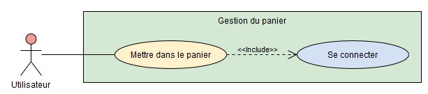

## Les extensions

Les extensions, au contraire des inclusions, permettent de définir une dépendance faible. Si une fonctionnalité en étend une autre, cela signifie qu'elle pourra potentiellement être appelée lorsque l'autre sera exécutée.

Cette relation est symbolisée par une flèche pointillée portant le label <<extend>> et par la création d'un point d'extension dans le cas d'utilisation, qui permet d'attribuer un nom à chaque extension. La liste des points d'extension doit être précédée par le titre « extension points ».

Chaque relation d'extension peut être accompagnée d'une note indiquant à quel point d'extension elle fait référence, et quelle est la condition d'exécution du cas d'utilisation étendu.

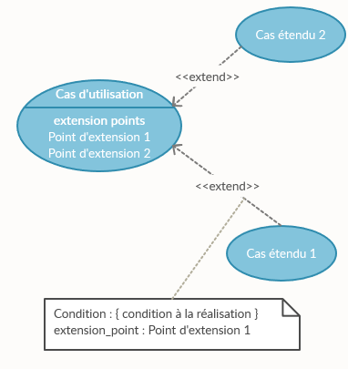

## La généralisation

La généralisation permet de préciser qu'un cas d'utilisation est une variante d'un autre. Le cas général peut ainsi être substitué à sa spécialisation. La généralisation peut s'apparenter au principe d'héritage des langages de programmation orientés objet et permet de créer des cas d'utilisation généraux qui pourront être précisés. La généralisation est symbolisée par une flèche pleine à la pointe blanche.

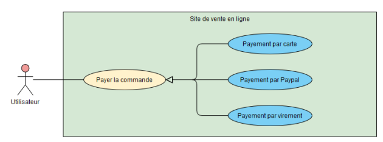

## Diagramme de paquetages

Le diagramme de paquetages (aussi appelé diagramme de packages) permet d'organiser des éléments, quels qu'ils soient, en les regroupant dans des ensembles, appelés « paquetages ». Il peut ainsi être utilisé dans de nombreux cas, mais on peut en distinguer deux principaux : regrouper des cas d'utilisation en différentes parties afin d'avoir une vue d'ensemble du projet, et structurer les différents classes issues d'un diagramme de classes. Ce diagramme a donc sa place à la fois dans des spécifications fonctionnelles et techniques.

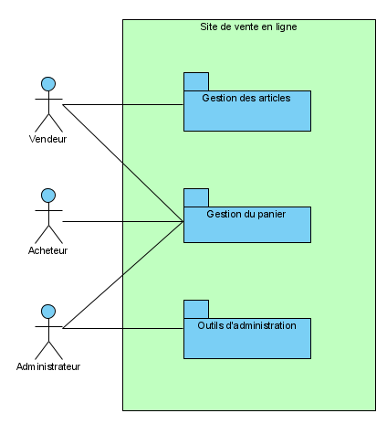

## Diagramme d'activité

Le diagramme d'activité est un diagramme permettant une décomposition en étapes d'un cas d'utilisation. Il est utilisé pour décrire le processus de résolution d'une fonctionnalité complexe afin que le client et l'équipe de développement puissent visualiser précisément son déroulement.

### Les nœuds de base

Un diagramme d'activité est composé d'au moins trois nœuds de base.

Le premier est le nœud initial, qui représente le point de départ de la fonctionnalité. Il est modélisé par un petit cercle noir.

Le second est le nœud de fin d'activité, qui symbolise le point d'arrivée du cas d'utilisation. Il est identique au nœud initial, mais possède un contour noir supplémentaire.

Enfin, chaque étape est représentée par un nœud d'action, sous la forme d'une ellipse contenant une courte description de l'étape.

Pour se déplacer d'un nœud à un autre, il faut utiliser des transitions, représentées par des flèches. Les transitions servent à définir l'ordre des différentes actions. Un nœud initial ne peut avoir qu'une transition sortante, un nœud de fin d'activité ne peut pas avoir de transition sortante, et une action doit avoir une seule transition entrante et une seule transition sortante.

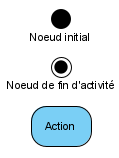

### Le nœud de décision

Certains cas d'utilisation peuvent avoir plusieurs scénarios possibles pendant leur exécution. Reprenons l'exemple du site de vente en ligne ci-dessus, en lui rajoutant une étape : l'article que l'on met dans le panier doit être en stock. Il va donc falloir vérifier si l'article est disponible, ce qui va diviser notre diagramme en deux cas : s'il est disponible, alors on l'ajoute au panier, sinon, on affiche un message d'erreur.

Pour illustrer cette séparation dans un diagramme d'activité, il faut y ajouter un nœud de décision, sous la forme d'un losange. Plusieurs transitions peuvent partir d'un nœud de décision : il y aura donc une flèche par cas possible. Chaque flèche doit être accompagnée d'un texte indiquant dans quelle condition utiliser la transition.

On peut voir un nœud de décision comme un switch, chaque transition sortante étant un case.

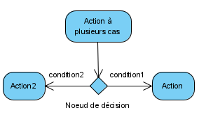


### Bifurcation et fusion

Il peut arriver que certaines actions du diagramme puissent se faire en parallèle, de sorte que l'ordre de leur exécution n'importe pas. Il est alors possible de séparer notre diagramme en deux branches grâce à un nœud de bifurcation, puis de regrouper ces deux branches plus loin grâce à un nœud de fusion.

Ces nœuds sont symbolisés par un épais trait noir. La différence entre les deux est qu'un nœud de bifurcation ne possède qu'une transition entrante et plusieurs transitions sortantes, tandis qu'un nœud de fusion possède plusieurs transitions entrantes et une seule sortante.

Le nœud de fusion permet d'attendre que toutes les actions en amont soient terminées avant de continuer. Sur le schéma de droite, Action2 ne sera exécutée que lorsque les deux actions en parallèle auront fini leur tâche.

Le nœud de bifurcation se différencie du nœud de décision par le fait que, lors d'une bifurcation, toutes les actions seront exécutées, tandis que le nœud de décision ne choisit qu'une seule action selon certaines conditions.

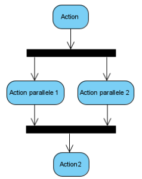

## Une variante : le diagramme états-transitions

Il arrive que certains éléments d'une application se basent sur des états internes, qui vont décider des fonctionnalités qui vont pouvoir être exécutées. Par exemple, on peut découper la vie d'une commande d'un site de vente en ligne en plusieurs états : « Au panier », « Commandée », « Expédiée », « Annulée » et « Terminée ». Tous les cas d'utilisation ne seront pas accessibles à tous les états, et c'est l'exécution de certaines fonctionnalités qui fera passer la commande d'un état à l'autre. Cet enchaînement d'états peut parfois être complexe, mais il existe un diagramme UML permettant de clarifier ces interactions : le diagramme états-transitions.

Le diagramme états-transitions peut être vu comme une variante du diagramme d'activité : on y retrouve un état initial, un état final, des états et des transitions qui utilisent les mêmes symboles. Cependant, ces deux diagrammes ont des utilisations complètement différentes : plutôt que de se focaliser sur un cas d'utilisation, le diagramme états-transitions va se concentrer sur une entité de l'application et décrire comment certaines fonctionnalités vont faire la transition entre ces états.

Dans la pratique, cette différence est exprimée par le fait que l'action permettant de passer d'un état à un autre est toujours indiquée sur la flèche représentant la transition. De plus, les nœuds de décision ne sont pas nécessaires : un état peut avoir plusieurs transitions, liées à des actions différentes.

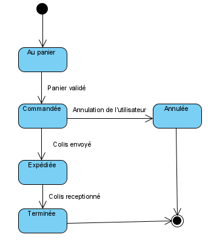

## Diagramme de séquence

Le diagramme de séquence est un diagramme permettant d'illustrer, pour un cas d'utilisation, toutes les interactions entre les différents acteurs, comme l'utilisateur, l'application elle-même et tous les systèmes externes nécessaires. Il permet d'avoir une vision détaillée de toutes les communications effectuées pendant l'exécution d'une fonctionnalité, dans l'ordre chronologique.

### Acteurs et lignes de vie

Le diagramme de séquence s'écrit sous forme de colonnes, une par acteur, et se lit de haut en bas. Contrairement aux autres diagrammes en UML, seul l'acteur principal (c'est-à-dire celui qui déclenche la fonctionnalité) est symbolisé par un bonhomme bâton : les autres sont écrits sous forme de rectangles contenant leurs noms.

Chaque acteur possède sa propre ligne de vie, qui est une ligne en pointillés permettant d'exprimer les moments où l'acteur est actif. Les périodes d'activité sont représentées par des rectangles pleins. À noter que l'utilisateur principal est toujours actif, puisqu'il commence l'exécution de la fonctionnalité et qu'il attend de recevoir la réponse finale.

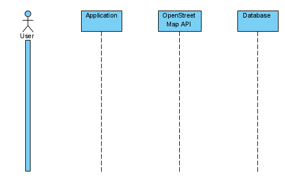

### Messages

Chaque acteur va communiquer avec les autres grâce à des messages, représentés par des flèches accompagnées d'un texte indiquant la nature du message. Ce texte peut être sous la forme d'une simple description ou indiquer l'appel à une fonction.

Lorsqu'un acteur envoie un message à un autre, il attend généralement une réponse, qui peut soit être une valeur, soit un simple code indiquant si la requête a bien été effectuée. Elle est symbolisée par une flèche pointillée accompagnée d'un texte décrivant la réponse. Les deux acteurs deviennent alors actifs tant que la réponse n'a pas été générée, ce qui modifie l'apparence de leur ligne de vie en conséquence : les pointillés sont remplacés par des rectangles pleins.

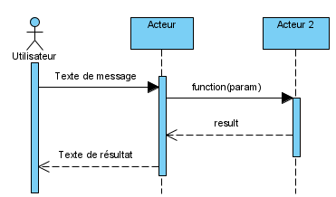

## Listons toutes les étapes de notre application de cartographie dans leur ordre chronologique :

- L'utilisateur remplit un champ avec une adresse dont il souhaite connaître les coordonnées GPS

- L'application va vérifier si cette adresse existe en base de données (pour l'exemple, nous prenons le cas où elle n'existe pas)

- L'application va récupérer les coordonnées sur l'API d'OpenStreetMap

- L'application va stocker l'adresse et les coordonnées en base de données

- L'application va retourner les coordonnées à l'utilisateur

Ce cas donne le diagramme de séquence suivant :

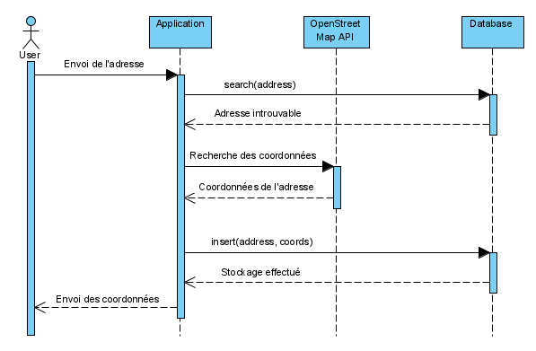

Un diagramme de séquence ne représente qu'un seul scénario possible du cas d'utilisation. Dans notre exemple, si l'on souhaite également illustrer le cas où l'adresse est trouvée en base de données, alors il faut réaliser un autre diagramme de séquence :

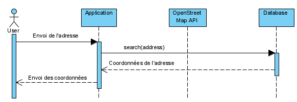

Il est cependant possible de combiner un diagramme d'activité et plusieurs diagrammes de séquence pour faire un diagramme global d'interactions. Ce diagramme permet de regrouper tous les scénarios en un seul diagramme en utilisant les éléments de logique d'un diagramme d'activité :

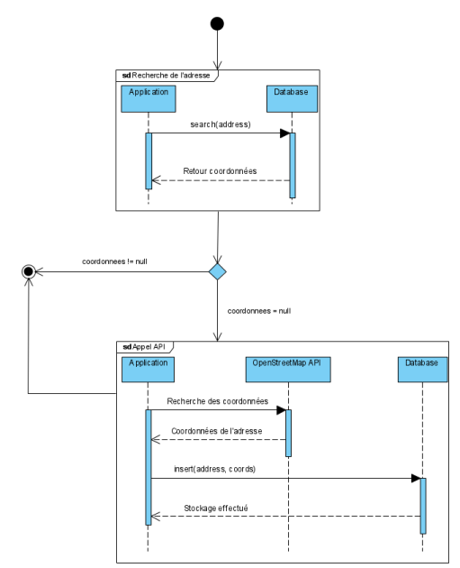

## Une variante : le diagramme de temps

Le diagramme de temps est une variante du diagramme de séquence qui se lit horizontalement, de gauche à droite, et qui se concentre sur l'évolution des états de chaque acteur dans le temps. Contrairement au diagramme de séquence, le diagramme de temps utilise un axe temporel précis permettant d'indiquer le temps d'exécution de chaque étape.

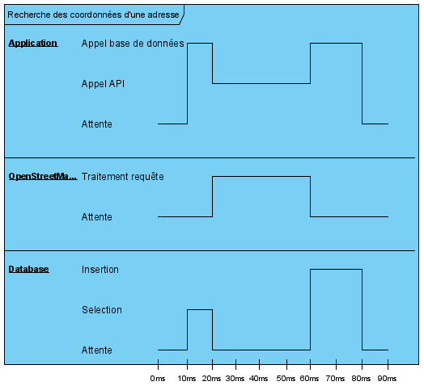

Le diagramme de temps permet de mettre en valeur les étapes qui peuvent nuire aux performances de l'application. Dans l'exemple ci-dessus, on peut voir que l'étape la plus longue est le traitement de la requête par OpenStreetMap. On peut imaginer que c'est ce constat qui a mené à la mise en place du système de stockage des adresses en base de données.

# Introduction au passage UML - relationnel

## Une classe = une table

Chaque classe de notre diagramme représente une table qui sera présente dans la base de données.

Le nom de la table issue d'une classe est le nom de la classe mise au pluriel. En effet, une instance représente une ligne de données : en faisant new Classe(), on ne crée qu'un seul élément, il est donc logique que le nom de la classe soit au singulier. En revanche, une table contient plusieurs éléments, son nom doit donc être au pluriel. Le format du nom est également différent : les noms de classe sont en PascalCase, tandis que les noms de table sont en snake_case.

Soit la classe User définie par le diagramme suivant :

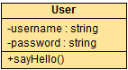

La table associée devra se nommer users.

Toutes les classes du diagramme ne doivent pas être transformées en bases de données : seules celles représentant des structures de données doivent l'être.

Par exemple, si notre application possède une classe Product pour gérer les données de produits à vendre, ainsi que plusieurs classes de formatage pour afficher de manières différentes les informations du produit, seules les données de la classe Product devront être stockées en base.

## Une propriété = un champ

Les champs de la table doivent correspondre aux propriétés de la classe. Le type de chaque champ doit également correspondre au type de la propriété. Si le type ne correspond pas, alors il faut déterminer le type le plus proche.

Les règles métiers pourront permettre de déterminer si un champ est obligatoire ou non.

Les méthodes, quant à elles, ne sont pas implémentées dans le modèle relationnel.

Notre classe User possède deux propriétés de type string : username et password. Ce type n'a pas de correspondance exacte en SQL : nous avons le choix entre CHAR, VARCHAR et TEXT. Il faut donc déterminer le type exact et sa taille grâce à des règles métier et/ou techniques.

- Un username a une taille variable : le type VARCHAR est donc préférable. La taille maximale devra être déterminée par le design du site et par la place réservée à l'affichage du nom.

- Pour le mot de passe, l'algorithme de cryptage recommandé est BCRYPT, qui génère des chaînes de 60 caractères. Le champ password sera donc un CHAR(60).

Ces deux champs seront obligatoires à la saisie.

## La clé primaire

La dernière étape est de déterminer la clé primaire de notre table à partir des propriétés de notre classe. Pour cela, deux solutions existent :

- Déterminer une clé primaire naturelle, c'est-à-dire une clé primaire composée uniquement des données présentes dans la classe. Si la classe possédait déjà une information unique et qui ne sera jamais modifiée, alors elle pourra être utilisée comme clé primaire.

- Créer une nouvelle colonne qui accueillera une clé primaire artificielle, soit auto-incrémentée, soit de type UUID. Dans ce cas, il faudra également rajouter la nouvelle colonne dans la classe.

Il est très souvent préférable d'avoir une clé artificielle. Cet identifiant est généralement réfléchi en amont et donc déjà inclus dans le diagramme de classes, mais il ne faut pas oublier de le rajouter dans le cas contraire.

Dans la grande majorité des cas vous retrouverez cet identifiant sous le nom id.

La requête permettant de créer la table représentant la classe Users est :

```sql
CREATE TABLE users (
    id INT(11) NOT NULL AUTO_INCREMENT PRIMARY KEY,
    username VARCHAR(50) NOT NULL,
    password CHAR(60) NOT NULL
);
```

La commande AUTO_INCREMENT permet d’incrémenter automatiquement l’id à chaque ajout d’un utilisateur en base de données sans action de notre part, ce qui permet de garantir l’unicité de notre clé primaire.

## One-To-Many

Une relation One-To-Many est une association qui a une cardinalité unique d'un côté (donc 1 ou 0..1) et une cardinalité multiple de l'autre (0..*, 1..*). C'est l'association la plus courante.

La relation entre une entreprise et ses employés peut être définie par une relation One-To-Many :

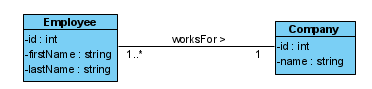

Un employé travaille pour une seule (one) entreprise, on ajoute donc la cardinalité représentant une instance exactement du coté entreprise => 1, chaque entreprise possède un ou plusieurs (many) employés, on ajoute donc la cardinalité représentant une instance ou plusieurs coté employé => 1..*

On se trouve bien dans une relation cardinalité unique vers multiple donc One-To-Many.

Une relation One-To-Many peut également être appelée Many-To-One : cela dépend du sens de lecture. Ainsi, une entreprise a une relation One-To-Many avec ses employés, mais un employé a une relation Many-To-One avec une entreprise.

Cette subtilité n'a aucune incidence sur le modèle relationnel : dans le reste de ce chapitre, nous n'utiliserons que le terme de One-To-Many.

Les clés étrangères

La clé étrangère va nous permettre de créer cette relation entre les deux tables dans notre base de données. Pour cela, il faut créer un champ dans la table du côté « Many » de l'association, qui sera une clé étrangère vers la table du côté « One ».

Dans notre exemple précédent, on a pu mettre en évidence qu’un employé travaillait pour une seule compagnie, on va donc ajouter un champ dans notre table employé pour nous permettre d’identifier cette compagnie.

Le diagramme de classes nous a permis de créer une table companies et une table employees. Pour gérer l'association One-To-Many entre les deux, il faut rajouter un champ works_for dans la table employees, qui sera une clé étrangère vers la table companies :

```sql
CREATE TABLE companies (
    id INT(11) NOT NULL AUTO_INCREMENT PRIMARY KEY,
    name VARCHAR(50) NOT NULL
);

CREATE TABLE employees (
    id INT(11) NOT NULL AUTO_INCREMENT PRIMARY KEY,
    first_name VARCHAR(50) NOT NULL,
    last_name VARCHAR(50) NOT NULL,
    works_for INT(11) NOT NULL,
    FOREIGN KEY (works_for) REFERENCES companies(id)
);
```

Maintenant notre table employé contient l’id d’une entreprise stocké dans le champ work_for, cette id nous permet de retrouvé la société ayant le même id dans notre base de données et donc d’accéder à son nom par exemple.

## Composition et agrégations

L’agrégation et la composition sont deux types d'associations particulières, et le choix de l'une ou l'autre peut avoir une incidence sur le modèle relationnel. En effet, si l'agrégation est à considérer comme une association normale, une subtilité existe avec la composition : la clé étrangère générée doit faire partie de la clé primaire. Cela s'explique par le fait que la composition exprime une dépendance forte entre les deux éléments : l'un ne peut pas exister si l'autre est détruit.

Cette dépendance peut également être gérée grâce à l'instruction SQL CASCADE, qui permet de définir l’impact de la suppression d'une ligne sur toutes ses relations. En cas de composition, la suppression d'une ligne de la table cible devra entraîner la suppression de toutes ses compositions.

## Le cas particulier de la classe d'association

Dans le cas d'une classe d'association, les champs de cette classe doivent être rajoutés du côté « Many ». Par exemple, rajoutons un badge à notre employé :

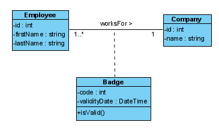

Dans ce cas, les propriétés code et validityDate donneront deux nouveaux champs dans la table employees.

## Impact des cardinalités nulles

Pour chaque côté de l'association, il y a deux choix de cardinalités possibles : soit la valeur 0 est admise (0..1 et 0..*), soit elle ne l'est pas (1 et 1..*).

- Une cardinalité nulle du côté Many (0..*) n'a aucune influence sur le modèle relationnel : on aura simplement une clé primaire qui ne sera pas référencée en tant que clé étrangère. Par exemple, si une entreprise possède une cardinalité 0..* vers ses employés, alors il pourra exister une entreprise pour laquelle aucun employé n'est stocké en base.

- Une cardinalité nulle du côté One (0..1), en revanche, indique que la clé étrangère peut être nulle, et qu'il faut donc modifier cette contrainte au moment de la création de la table. C'est le cas, par exemple, si un employé peut ne pas être rattaché à une entreprise : la valeur de works_for sera nulle.

Si on remplace les cardinalités de notre exemple par leur équivalent nul, alors il faut préciser que la clé étrangère de la table employees peut ne pas être définie :

```sql 
CREATE TABLE companies (
    id INT(11) NOT NULL AUTO_INCREMENT PRIMARY KEY,
    name VARCHAR(50) NOT NULL
);

CREATE TABLE employees (
    id INT(11) NOT NULL AUTO_INCREMENT PRIMARY KEY,
    first_name VARCHAR(50) NOT NULL,
    last_name VARCHAR(50) NOT NULL,
    works_for INT(11) NULL, -- La clé étrangère peut être nulle
    FOREIGN KEY (works_for) REFERENCES companies(id)
);
```

## One-To-One

Une relation One-To-One est une association qui a une cardinalité unique (0..1 ou 1) des deux côtés de l'association.

À chaque employé est assignée une place de parking. Certains employés peuvent ne pas en vouloir, et certaines places peuvent être vacantes :

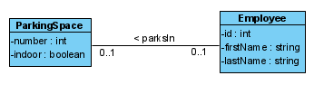

## La méthode One-To-Many

La première solution est de traiter les One-To-One de la même manière que des One-To-Many : en choisissant une table qui recevra une clé étrangère vers l'autre. Le choix de la table est arbitraire et dépend de la sémantique des éléments. Ainsi, dans l'exemple ci-dessus, il appartiendrait au développeur de déterminer si un employé possède une place de parking, ou si une place de parking contient un employé.

Si notre application gère en premier lieu des employés, alors il est plus logique qu'un employé possède une place de parking :

```sql
CREATE TABLE parking_space(
    number INT(11) NOT NULL PRIMARY KEY,
    indoor TINYINT(1) NOT NULL -- Le type "boolean" n'est pas disponible sur tous les SGBD et est souvent remplacé par un TINYINT ou une énumération
);

CREATE TABLE employees (
    id INT(11) NOT NULL AUTO_INCREMENT PRIMARY KEY,
    first_name VARCHAR(50) NOT NULL,
    last_name VARCHAR(50) NOT NULL,
    parks_in INT(11) NULL,
    FOREIGN KEY (parks_in) REFERENCES parking_space(number)
);
```

À l'inverse, si le point central de notre application est de gérer des places de parking, alors la clé étrangère doit être dans la table parking_space.

## La méthode de fusion

Une autre méthode consiste en la fusion de toutes les propriétés des deux classes en une seule table. La clé primaire de cette table dépend des informations des tables :

- Si aucune clé naturelle ne peut être trouvée, alors une clé artificielle doit être créée.

- Si une clé naturelle est trouvée dans une table, mais pas dans l'autre, alors elle peut être utilisée comme clé primaire.

- Si chaque table possède une clé naturelle, alors l'une d'entre elles est désignée arbitrairement comme clé primaire, et l'autre devra avoir une contrainte d'unicité.

Dans notre exemple, la table parking_space possède un identifiant naturel : un numéro de place. Il est donc possible de retirer la clé artificielle id de la table employees dans la table fusionnée :

```sql
CREATE TABLE employees_parking_space(
    number INT(11) NOT NULL PRIMARY KEY,
    indoor TINYINT(1) NOT NULL,
    first_name VARCHAR(50) NOT NULL,
    last_name VARCHAR(50) NOT NULL
);
```

Attention aux noms des propriétés au moment de la fusion : il ne faut pas que deux colonnes aient le même nom.

Quelle méthode choisir ?

Il existe plusieurs critères permettant de choisir l'une ou l'autre des méthodes :

- Si l'une des deux tables possède des cardinalités nulles, alors il est préférable de garder les deux tables en utilisant la méthode One-To-Many. En effet, l'exemple de fusion ci-dessus possède un inconvénient majeur : il est spécifié que certains employés peuvent ne pas avoir de place de parking. Or, le numéro de place étant la clé primaire, les employés n'ayant pas de place ne pourront pas être insérés dans la base. De plus, même avec une clé primaire artificielle, fusionner ces informations dans la même table signifie que de nombreuses colonnes seront à NULL.

- La sémantique et la facilité de manipulation des informations est également importante : il faut juger de la pertinence de la fusion des informations. Si une classe Person a une relation One-To-One avec une classe Address, la fusion peut sembler pertinente. En revanche, si chaque Person a une relation One-To-One avec une mère et un père (deux autres Person), alors il est préférable de ne pas rajouter les informations des parents dans la table Persons, mais plutôt de rajouter des clés étrangères.

Chaque cas est différent et il n'existe pas de solution qui fonctionne à tous les coups. Il faut prendre le temps de traiter chaque association et de déterminer la méthode qui sera la plus pratique à utiliser au moment du développement.

## Many-To-Many

Une relation Many-To-Many est une association qui a une cardinalité multiple (donc 0..* ou 1..*) des deux côtés de l'association.

Sur un site de vente en ligne, un utilisateur peut mettre plusieurs articles dans son panier et un article peut être présent dans le panier de plusieurs utilisateurs :

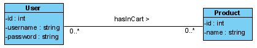

## Les tables associatives

Pour résoudre cette association, ajouter une clé étrangère dans une des tables ne suffit pas : une clé étrangère seule permet de ne lier qu'une ligne de données à une autre. Il va falloir créer une table d'association, c'est-à-dire une table où chaque ligne de données sera une association entre les tables.

Une table associative possède une clé étrangère par table, qu'elle lie, et sa clé primaire est définie par l'ensemble de ces clés étrangères : cela permet de s'assurer qu'une association n’apparaîtra qu'une seule fois.

Pour déclarer une clé primaire portant sur plusieurs colonnes dans une table, il faut utiliser la clause PRIMARY KEY([liste des colonnes]) à la fin de la requête CREATE TABLE, ou faire un ALTER TABLE après sa création.

Pour représenter les utilisateurs et leurs paniers, nous allons avoir besoin de trois tables : users, products et une table associative entre les deux. Étant donné qu'elle représente le contenu de chaque panier, nous pouvons l'appeler carts :

```sql
CREATE TABLE users (
    id INT(11) NOT NULL AUTO_INCREMENT PRIMARY KEY,
    username VARCHAR(50) NOT NULL,
    password CHAR(60) NOT NULL
);

CREATE TABLE products (
    id INT(11) NOT NULL AUTO_INCREMENT PRIMARY KEY,
    name VARCHAR(50) NOT NULL
);

-- Table associative
CREATE TABLE carts (
    user_id INT(11) NOT NULL,
    product_id INT(11) NOT NULL,
    PRIMARY KEY (user_id, product_id),
    FOREIGN KEY (user_id) REFERENCES users(id),
    FOREIGN KEY (product_id) REFERENCES products(id)
);
```

Les cardinalités nulles n'ont aucun impact sur le modèle relationnel. Elles signifient seulement que certains éléments n'auront aucune correspondance dans la table d'association.

## Le cas particulier de la classe d'association

Dans le cas d'une classe d'association, les champs de cette classe doivent être rajoutés dans la table associative. Par exemple, si nous souhaitons ajouter, pour chaque utilisateur, la quantité du produit qui a été ajouté dans le panier, comme ceci :

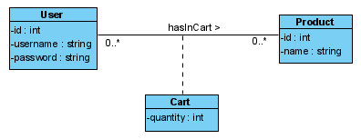

Alors la propriété quantity sera un champ de la table carts.

## L'héritage : quelle association ?

Pour illustrer cette logique, prenons l'exemple d'un site de vente en ligne sur lequel nous allons distinguer deux types d'utilisateurs : les utilisateurs de base et les vendeurs. Un utilisateur de base possède des informations qui lui sont propres (id, login et mot de passe) et peut acheter des articles. Un vendeur est un utilisateur de base, mais il dispose également d'une information en plus : le nom de la société qu'il représente. La classe représentant les vendeurs est donc la classe fille de la classe des utilisateurs de base.

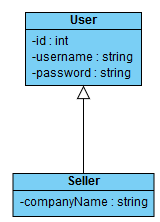

En réfléchissant en termes d'association entre les Sellers et les Users, on peut en déduire qu'un héritage est une relation One-To-One entre une classe fille et une classe mère. En effet, si on crée un vendeur appelé John et représentant la société ACME Inc., on peut en réalité le voir comme deux entités liées entre elles : d'un côté le User John et de l'autre le Sellers de ACME Inc.. Or, John n'a accès qu'aux informations du vendeur de ACME Inc., et inversement : nous sommes donc dans le cas d'une relation One-To-One.

Comme nous l'avons vu, une relation One-To-One peut être résolue de deux manières différentes : soit par fusion des propriétés en une seule table, soit en les traitant comme un One-To-Many. Or, dans le cas d'un héritage, la fusion n'est pas pratique à manipuler lorsqu'une classe possède plusieurs classes filles. Prenons l'exemple ci-dessous :

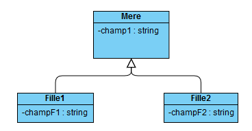

En utilisant la méthode de fusion des propriétés, le résultat sera une table possédant trois champs : champ1, champF1 et champF2. Or, dans la pratique, un objet sera soit une instance de Mere, soit de Fille1, soit de Fille2, donc les champs correspondant aux autres classes filles seront forcement nuls, ce qui n'est pas optimal. Il faut donc traiter l’héritage avec la méthode One-To-Many.

## Un One-To-Many particulier

Comme pour un One-To-Many, il va falloir créer deux tables : une représentant la classe fille et une autre la classe mère ; puis ajouter une clé étrangère dans la table fille vers la table mère.

Cependant, cette solution seule ne permet pas de représenter correctement l'héritage : en l'état, il serait possible de lier les données d'une ligne de table mère à plusieurs lignes de la classe fille. Pour éviter cela, et garder le caractère One-To-One de l'héritage, la clé primaire de la classe fille doit être la clé étrangère. Ainsi, pour une ligne de la classe mère, il ne pourra y avoir qu'une seule ligne de la classe fille correspondante.

Si nous souhaitons créer le modèle relationnel du site de vente en ligne donné ci-dessus, alors nous allons devoir créer une table users et une table sellers, puis rajouter une clé étrangère dans sellers, qui sera également la clé primaire de cette table.

```sql
CREATE TABLE users (
    id INT(11) NOT NULL AUTO_INCREMENT PRIMARY KEY,
    username VARCHAR(50) NOT NULL,
    password CHAR(60) NOT NULL
);

CREATE TABLE sellers (
    user_id INT(11) NOT NULL PRIMARY KEY, -- Clef primaire
    companyName VARCHAR(50) NOT NULL,
    FOREIGN KEY (user_id) REFERENCES users(id)
);
```

# Base de données et SGBD

Une base de données (BDD) est un ensemble de données structurées : elle contient à la fois une structure de données et des données.

Un système de gestion de base de données (SGBD) est un logiciel fournissant une base de données fonctionnelle.

Ce logiciel fournit non seulement une base de données, mais également les outils permettant de la gérer.

## Structures de données

Il existe plusieurs types de SGBD. Ce cours s'appuie sur MariaDB, qui appartient à la famille des SGBDR (R pour relationnel).

Un SGBD fonctionne avec un moteur de base de données. Chaque SGBD dispose d'au moins un moteur, certains, comme MariaDB, en possèdent plusieurs, laissant à l'utilisateur le choix.

Le sujet des moteurs de base de données est un sujet très complexe qui dépasse très largement le cadre de ce cours, c'est pourquoi le moteur par défaut de MariaDB sera utilisé. Ce moteur est appelé InnoDB.

## Tables, colonnes et lignes

Dans une base de données relationnelle comme MariaDB, les données sont organisées en tableaux à deux dimensions, appelés « tables ».

Les colonnes de ces tables représentent la structure des données. Par exemple, une table conservant des données nom, prénom, téléphone et e-mail contiendra une colonne pour les noms, une colonne pour les prénoms, et ainsi de suite.

Une ligne de cette table représente un enregistrement. Pour enregistrer la données « Jean Dupont », la base de données inscrira donc sur la même ligne « Dupont » dans la colonne Nom, et « Jean » dans la colonne Prénom.

Le croisement d'une ligne et d'une colonne représente donc une donnée unitaire, appelée « champ » ou « attribut ».

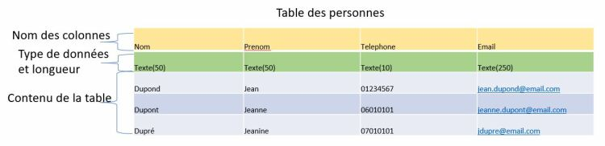

## Le rôle du SGBD

Les données sont écrites sur le stockage physique (disque dur, SSD...) de la machine hébergeant la base de données.

Le SGBD est en fait une abstraction du stockage physique : au lieu d'écrire directement les données sur le disque dur de la machine, on utilise un outil qui va s'en charger.

L'intérêt de cet outil est qu'il dispose de nombreuses fonctions : ce n'est pas qu'un simple outil de lecture et d'écriture. Par exemple, il permet de trouver rapidement un ensemble de données selon de nombreux critères.

Il est toutefois important de se rappeler qu'un ordinateur n'est capable de gérer que des données binaires, c'est-à-dire des suites de 0 et de 1. Un ordinateur ne stocke pas de dates, de nombres ou du texte, mais simplement des 0 et des 1. C'est le SGBD qui fait la traduction entre le binaire et la donnée.

Une même chaîne binaire peut avoir des sens totalement différents selon la traduction que l'on utilise. Le SGBD va donc à la fois retenir la chaîne binaire (la donnée) et son format (la structure).

## Les différents formats de données

Il existe de nombreuses normes :

- Pour les dates, les plus fréquentes sont JJ/MM/AAAA, MM/JJ/AAAA et AAAA/MM/JJ.

- Pour les nombres, on différencie les nombres entiers, les nombres décimaux (qui représentent les valeurs exactes des nombres à virgule) et les nombres à virgule flottante (qui représentent une approximation, moins coûteuse en place, mais peu adaptée pour le calcul).

- Le cas du texte est plus complexe. Non seulement il y a de nombreux alphabets, mais de nombreux caractères spéciaux existent au sein d'un même alphabet (tels que l'æ immortalisé par Serge Gainsbourg ou le ñ, présent dans de nombreux noms ibériques).

- - Les correspondances entre un caractère et sa représentation binaire sont rassemblées dans des tables d'encodage. La table la plus connue est la table ASCII, mais il s'agit d'une table très simple, qui n'est pas appropriée pour un usage moderne.

- - Il existe une norme universelle appelée Unicode. Plusieurs encodages différents sont issus de cette norme. Le plus utilisé est l'UTF-8, et c'est celui qui sera recommandé dans le cadre de ce cours. Dans MariaDB, l'encodage correspondant à l'UTF-8 se nomme utf8mb4.

## Le terme « base de données »

Le terme « base de données » peut désigner plusieurs choses. On l'utilise souvent pour désigner le SGBD, donc l'ensemble logiciel incluant la base de données proprement dite.

Ici, le terme de base de données détermine en fait un compartiment au sein de la base de données proprement dite, compartiment qui va héberger les tables.

Pour plus de clarté, le terme employé à présent sera celui de « schéma ».

## Créer un schéma

Il existe deux instructions permettant de créer un schéma :

- CREATE DATABASE NomDuSchema;

- CREATE SCHEMA NomDuSchema;

Ces deux instructions sont équivalentes.

Un schéma peut être comparé à un dossier dans un système de fichiers. Une base de données doit contenir au moins un schéma pour accueillir les tables.

## Créer une table

L'instruction pour créer une table est :

```sql
CREATE TABLE NomDeTable
(
Colonne1 Type_de_donnée Modificateurs,
Colonne2 Type_de_donnée Modificateurs,
(...)
);
```

## Type de donnée : nombres décimaux

Une base de données dispose d'un espace de stockage fini. Par conséquent, une base de données ne stocke que des nombres décimaux, pas des nombres réels.

Il existe principalement deux formats pour les nombres non-entiers dans une base de données :

- Les formats dits décimaux, qui sont constitués d'un nombre entier et d'une puissance de 10 fixe

- Les formats dits à virgule flottante, qui sont constitués d'un nombre entier et d'une puissance de 10 variable

## Le type décimal

Un décimal en base de données est défini par un entier constitué de x chiffres et d'un second entier déterminant la position de la virgule.

La position de la virgule est commune à toutes les données de la colonne.

Le format s'écrit : DECIMAL(x, y) avec x étant le nombre de chiffres significatifs (de 1 à 65) et y étant le nombre de chiffres après la virgule (de 0 à 38).

## Nombres à virgule flottante (base de données)

Un nombre à virgule flottante en base de données est défini par un entier constitué de x chiffres, appelé « mantisse », et d'un second entier déterminant la position de la virgule, appelé « exposant ».

De la sorte, le nombre stocké correspond à : Mantisse * 10exposant.

Il existe deux tailles de format, sur 4 et 8 octets : FLOAT et DOUBLE.

Pour des raisons complexes qui sortent du cadre de ce cours, les nombres à virgule flottante ne sont pas adaptés pour des valeurs décimales précises, telles que des prix, des quantités... Ce sont des valeurs approchées, et non pas des valeurs exactes.

## Les nombres à virgule flottante sont adaptés pour des mesures scientifiques, comme les valeurs renvoyées par des capteurs.

Il est très fortement recommandé d'utiliser DECIMAL dans tous les types de colonnes n'étant pas destinés à conserver des données scientifiques.

Seul le format DECIMAL garantit des calculs exacts sur les valeurs du quotidien.

## Texte de longueur fixe

Dans une colonne de type texte de longueur fixe, un texte sera tronqué s'il est trop long, et complété par des espaces à la suite s'il est trop court. Le mot-clé correspondant est : CHAR(Longueur).

La longueur doit être comprise entre 1 et 255.

## Texte de longueur variable

Dans une colonne de type texte de longueur variable, un texte sera tronqué s'il est trop long. Par contre, il ne sera pas complété par des espaces s'il est trop court, il sera conservé tel quel. Le mot-clé correspondant est : VARCHAR(Longueur).

La longueur doit être comprise entre 1 et 255.

## Texte long

Lorsqu'un texte est plus long que 255 caractères, il existe un autre format, moins performant, appelé TEXT : TEXT(Longueur).Longueur doit être compris entre 1 et 65535.

Notez toutefois qu'il n'est pas obligatoire de préciser la longueur du format TEXT. Si vous utilisez TEXT sans la spécifier, vous pourrez tout de même stocker un texte d'une longueur, comme indiquée, comprise entre 1 et 65535.

## Date et heure

MariaDB propose plusieurs formats pour conserver les dates et les heures. Les plus utilisés sont :

- DATETIME pour conserver à la fois la date et l'heure

- DATE pour ne conserver que la date

- TIME pour ne conserver que l'heure

## Modificateurs de colonne

Il existe de nombreux modificateurs en fonction des SGBD. Les plus courants sont :

- NOT NULL : indique qu'une colonne ne peut pas avoir une valeur vide de données.

- NULL : indique qu'une colonne peut avoir une valeur vide de données. Ce paramètre est implicite.

- DEFAULT valeur : indique que, si une ligne est créée dans la table sans qu'une valeur ne soit précisée pour cette colonne, la colonne prendra la valeur spécifiée.

## Supprimer une table ou une colonne

Pour supprimer une table, l'instruction à employer est : DROP TABLE Nom_de_la_table.

## Ajouter ou supprimer une colonne

La modification de la structure d'une table se fait grâce à l'instruction ALTER TABLE, suivie de l'action à réaliser.

- Pour ajouter une colonne, il faut utiliser la requête SQL suivante :

ALTER TABLE Nom_de_la_table

ADD Nom_de_colonne Type_de_colonne Modificateurs

- Et pour supprimer une colonne :

ALTER TABLE Nom_de_la_table

DROP Nom_de_colonne

## Modifier une colonne existante

- Pour modifier la définition d'une colonne :

ALTER TABLE Nom_de_la_table

MODIFY Nom_de_colonne Type_de_colonne Modificateurs

- Et pour renommer une colonne :

ALTER TABLE Nom_de_la_table

CHANGE Ancien_nom Nouveau_nom Type_de_colonne Modificateurs

## Identifiants

Une clé primaire est habituellement constituée d'une seule colonne, mais elle peut être composée de plusieurs colonnes  : ce type de clé est nommée « clé  primaire composite ». Par définition, la ou les colonnes de la clé primaire ne peuvent pas recevoir de valeur nulle.

Autre exemple possible :

```sql
CREATE TABLE article (
  		id_article INT NOT NULL,
  		lang CHAR(2) NOT NULL,
  		title VARCHAR(255) NOT NULL,
  		author VARCHAR(255) NOT NULL,
  		PRIMARY KEY (id, lang)
```

Pour y ajouter des données, vous pouvez alors utiliser :
```sql
INSERT INTO article (id_article, lang, title, author) VALUES ("1", "fr", "Initialiser une Base De Données", "");
INSERT INTO article (id_article, lang, title, author) VALUES ("1", "en", "Report", "Initialize a Databse");
INSERT INTO article (id_article, lang, title, author) VALUES ("2", "fr", "Tutoriel", "SQL pour les nuls");
INSERT INTO article (id_article, lang, title, author) VALUES ("2", "en", "Tutorial", "SQL for Dummies");
```

Les colonnes intervenant dans une PRIMARY KEY doivent recevoir le mot-clé NOT NULL.

Définir des clés primaires dans les tables d'une base de données est une bonne pratique. Il est habituel d’utiliser la colonne « id » pour choisir sa clé primaire. Vous pouvez suivre par exemple la convention de nommage « id_nomtable » pour nommer vos clés primaires.

## Fonction d'agrégation

Une fonction d'agrégation est une fonction qui prend en entrée un ensemble de données et fournit en sortie une valeur unique. Les fonctions les plus courantes en SQL sont :

- COUNT : effectue le décompte de l'ensemble des valeurs fournies en entrée

- SUM : effectue la somme de l'ensemble des valeurs fournies en entrée

- MIN : renvoie la plus petite valeur de l'ensemble

- MAX : renvoie la plus grande valeur de l'ensemble

- GROUP_CONCAT : concatène l'ensemble des données sous forme d'une chaîne de caractères

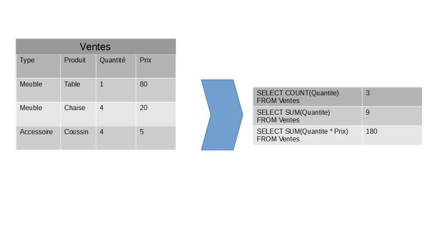

Voici trois exemples d'agrégation :

- COUNT renvoie le nombre de données disponibles. Dans cet exemple, il y a 3 données pour la colonne Quantité (1, 4 et 4).

- SUM(Quantite) effectue la somme des valeurs de la colonne Quantité, soit 1 + 4 + 4 = 9

Un ensemble n'est pas limité à une colonne, comme le montre le dernier exemple :

- SUM(Quantite * Prix) effectue la somme du produit des valeurs de Quantité et Prix, soit : (1 * 80) + (4 * 20) + (4 * 5) = 180

## Agrégation et filtre

Une agrégation n'est pas limitée au contenu de toute une colonne. Grâce à la clause WHERE d'une instruction SELECT, il est possible de filtrer les données à agréger.

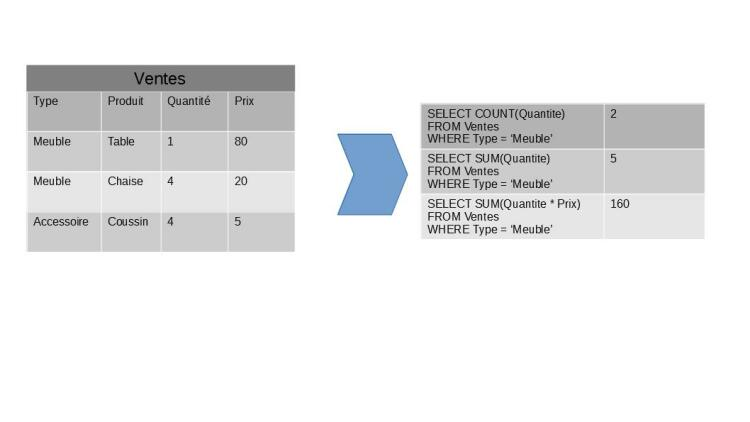

Cette fois-ci, les données sont filtrées sur les ventes de meubles. La ligne accessoire est donc exclue.

## Clause de groupe

La clause GROUP BY d'une instruction SELECT permet de spécifier une liste de colonnes par lesquelles regrouper les données. La base de données va parcourir ces colonnes dans l'ordre, et va regrouper les lignes de la table ayant des valeurs identiques sur ces colonnes.

Une colonne citée dans la clause GROUP BY ne sera pas agrégée.

La clause GROUP BY doit être écrite après une clause WHERE.

### L'ordre des clauses doit respecter un ordre bien précis dans une instruction SELECT.

Certaines clauses, comme les WHERE, sont facultatives, mais, si elles existent, elles doivent l'être dans cet ordre.

Une instruction SELECT avec une clause GROUP BY s'écrira donc ainsi :

```sql
SELECT
    Expressions à renvoyer
FROM 
    Table
WHERE
    Conditions
GROUP BY
    Liste des regroupements
```

## Fenêtrage

Le fenêtrage signifie que la requête va, pour un calcul précis, effectuer celui-ci selon un groupement déterminé pour ce calcul sans impacter les autres résultats. C'est l'équivalent d'un GROUP BY, mais pour lequel le résultat serait dupliqué pour chaque ligne concernée, plutôt que ressemblé en une seule ligne.

Le fenêtrage s'effectue via le mot-clé OVER (PARTITION BY ...), suivant immédiatement la fonction d'agrégation appelée.

Au contraire d'un groupement, le fenêtrage ne modifie pas le nombre de lignes renvoyées.

```sql
SELECT 
    Produit, Type,
    SUM(Quantité * Prix) OVER (PARTITION BY Type)
FROM Ventes
```

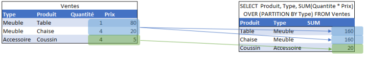

Dans cet exemple, le calcul Quantité * Prix est précisé par fenêtrage sur le type. Le SELECT renvoie toujours trois lignes, comme dans la table des ventes. Il n'y a pas de regroupement par type. En revanche, la somme effectuée est calculée selon le fenêtrage par type : toutes les ventes du même type auront la même valeur.

Ici, le résultat de 160 correspond à la somme des quantités multipliées par les montants pour tous les meubles (chaises et tables), et ce résultat est repris à chaque ligne de type Meuble.

## Classement et cumul

Le mot-clé OVER permet également d'effectuer un calcul par cumul, c'est-à-dire que, pour chaque ligne, on ajoute la valeur de la ligne à celles des lignes précédentes. Cela se fait avec la clause ORDER BY au sein du OVER : OVER (ORDER BY ...).

Il est possible de cumuler les deux instructions : OVER (PARTITION BY ... ORDER BY ...).

Si on veut obtenir le cumul des ventes par type, il faut utiliser la requête :

```sql
SELECT 
    Produit, Type
    SUM(Quantité * Prix) OVER (ORDER BY Produit)
FROM Ventes
```

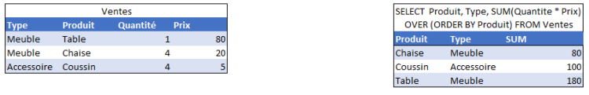

Le SELECT renvoie toujours trois lignes, comme dans la table des ventes :

- Pour la première ligne, le calcul est effectué sur le produit Quantité * Prix de la première ligne : 4 * 20

- Pour la deuxième ligne, le calcul est effectué cette fois-ci sur la somme des deux premières lignes : 4 * 20 + 4 * 5

- Pour la troisième ligne, le calcul est effectué cette fois-ci sur la somme de toutes les lignes : 4 * 20 + 4 * 5 + 1 * 80

## Obtenir un rang

Il est possible de numéroter chaque ligne par ordre d'apparition. Cela se fait via l'instruction Rank() OVER (ORDER BY ...).

```sql
SELECT 
    Produit, 
    Rank() OVER (ORDER BY Produit)
FROM Ventes
```

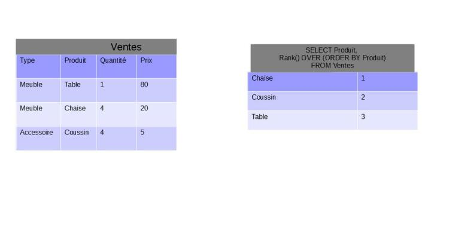

Le SELECT renvoie toujours trois lignes, comme dans la table des ventes. La seconde colonne indique simplement l'ordre des lignes.

## Filtre avant agrégation

Un filtre avant agrégation se fait au moyen de la clause WHERE d'une opération SELECT.

La clause WHERE est suivie d'une ou plusieurs conditions et doit être située après la clause FROM, mais avant la clause GROUP BY.

```sql 
SELECT 
    Produit,
    SUM(Quantite * Prix)
FROM Ventes
WHERE
    Type = 'Meuble'
GROUP BY 
    Produit
```

Il n'est pas possible de placer une condition dans la clause WHERE qui porte sur le résultat d'une agrégation, car l'agrégation ne s'est pas encore effectuée à ce stade de la requête.

Par exemple, il n'est pas possible de filtrer de façon à avoir la liste des produits dont les ventes ont dépassé une certaine somme, car cette somme n'est pas encore calculée.

Pour pouvoir effectuer un tel test, il faut utiliser un test après agrégation.

```sql
SELECT 
    Produit,
    SUM(Quantite * Prix) AS PrixTotal
FROM Ventes
GROUP BY 
    Produit
HAVING
    SUM(Quantite * Prix) >= 50
```

## Fonctionnement de la clause HAVING associée à une agrégation

La clause HAVING constitue un filtre après agrégation. Le SGBD va procéder aux opérations suivantes :

- Procéder à l'agrégation telle que décrite dans la clause GROUP BY

- Ne conserver que les lignes validant la condition de la clause HAVING

- Fournir les données calculées à l'utilisateur

Contrairement à une clause WHERE, la clause HAVING nécessite d'effectuer les calculs sur l'ensemble du lot avant de pouvoir filtrer, puisque la condition du filtre porte sur le résultat de ce calcul.

## WHERE et HAVING

La clause WHERE et la clause HAVING peuvent se combiner. Dans ce cas, le SGBD procède aux opérations dans l'ordre suivant :

- Filtrer les données selon les conditions décrites dans la clause WHERE

- Procéder à l'agrégation telle que décrite dans la clause GROUP BY

- Ne conserver que les lignes validant la condition de la clause HAVING

- Fournir les données calculées à l'utilisateur

La syntaxe est alors :

```sql
SELECT 
    ...
FROM Table1
WHERE
    Conditions de filtre avant agrégation
GROUP BY
    Liste des groupes
HAVING
    Conditions après agrégation
```

## Limitation des résultats

La clause LIMIT d'une opération SELECT permet de limiter les résultats renvoyés par la requête :

    Utilisée avec un seul paramètre numérique, LIMIT x permet de ne renvoyer que les x premières lignes de résultats

    Utilisée avec deux paramètres numériques, LIMIT x, y signifie d'ignorer les x premières lignes et de renvoyer les y suivantes. Ainsi, les lignes x+1 à x+y sont renvoyées

    LIMIT x, y peut également être écrite LIMIT y OFFSET x

La clause LIMIT doit être écrite après toute autre clause.

Dans une base de données, si aucun ordre n'est spécifié à l'aide d'une clause ORDER BY, il n'y a aucun ordre fiable. Par conséquent, s'il n'y a pas de clause ORDER BY, le résultat de LIMIT sera aléatoire.

Par exemple, un SELECT ... LIMIT 1, 10 suivi d'un SELECT ... LIMIT 11, 10 ne vont pas nécessairement renvoyer les 10 premières lignes, puis les 10 suivantes, car il s'agit de deux requêtes différentes sans ordre précisé.

La seconde instruction pourrait très bien renvoyer des lignes déjà renvoyées dans la première.

Pour utiliser sans risque d'erreur une clause LIMIT, il est nécessaire d'avoir une clause ORDER BY.

```sql
SELECT 
    Produit,
    SUM(Quantite * Prix)
FROM Ventes
WHERE
    Type = 'Meuble'
GROUP BY 
    Produit
ORDER BY 
    SUM(Quantite * Prix) DESC
LIMIT 1
```

Cette opération renvoie au produit le plus vendu en termes de montant de ventes. En effet, la clause ORDER BY permet de trier les produits dans l'ordre décroissant des montants de ventes, tandis que la clause LIMIT ne renvoie que la première ligne, donc celle avec le plus gros montant de ventes.

LIMIT est une clause valable dans MariaDB et dans certains SGBD comme PostGreSQL. D'autres SGBD, comme Sql Server ou Oracle, auront une façon différente de parvenir au même résultat. Référez-vous à la documentation du SGBD en question le cas échéant.

# Présentation de PostgreSQL

PostgreSQL est un système de gestion de bases de données relationnelles (SGBDR). Dans PostgreSQL, à l'instar des autres bases de données relationnelles, les données sont organisées en tableaux à deux dimensions, appelées tables.

Les colonnes de ces tables représentent la structure des données, tandis que les lignes de cette table représentent un enregistrement.

## Licence

PostgreSQL est sous licence BSD. La licence BSD autorise la réutilisation du logiciel sans restriction, y compris pour un usage commercial. Il s'agit d'une licence libre. PostgreSQL est donc libre et gratuit, y compris pour un usage commercial.

## La norme SQL

Afin d'essayer d'harmoniser la syntaxe et les fonctionnalités des bases de données, il existe une norme à laquelle les SGBD doivent se soumettre : la norme SQL. En théorie, l'existence de cette norme devrait permettre de garantir une constance entre les différents moteurs, mais, dans la pratique, il n'en est rien. En effet, cette norme ne décrit pas l'ensemble des fonctionnalités attendues d'un SGBD relationnel, mais seulement les fonctionnalités d'un socle.

Certaines règles de la norme peuvent également ne pas être respectées par un SGBD. Par exemple, MySQL version 5.0 ne gère pas le FULL OUTER JOIN ni les CTE (Common Table Expression), un outil disponible dans d'autres SGBD. Oracle, un autre SGBD, gère les CTE, mais n'offre aucun équivalent à la clause LIMIT de MySQL.

D'autres fonctionnalités peuvent également avoir été implémentées avant leur normalisation par l'ISO et avoir été conservées par souci de compatibilité ascendante. C'est pourquoi certains SGBD peuvent disposer de plusieurs alias pour une même fonction, comme par exemple SUBSTR, SUBSTRING ou MID, qui servent toutes les trois à extraire une sous-chaîne d'un texte.

## Requêtes CRUD

La structure de base d'une requête SQL reste la même dans tous les SGBDR. Les SELECT, UPDATE, INSERT et DELETE ne changent pas d'une base à l'autre.

## Les séquences

Une séquence est un compteur géré par la base de données. Elle est définie par un nom, une valeur initiale et un pas, et stocke sa valeur actuelle.

